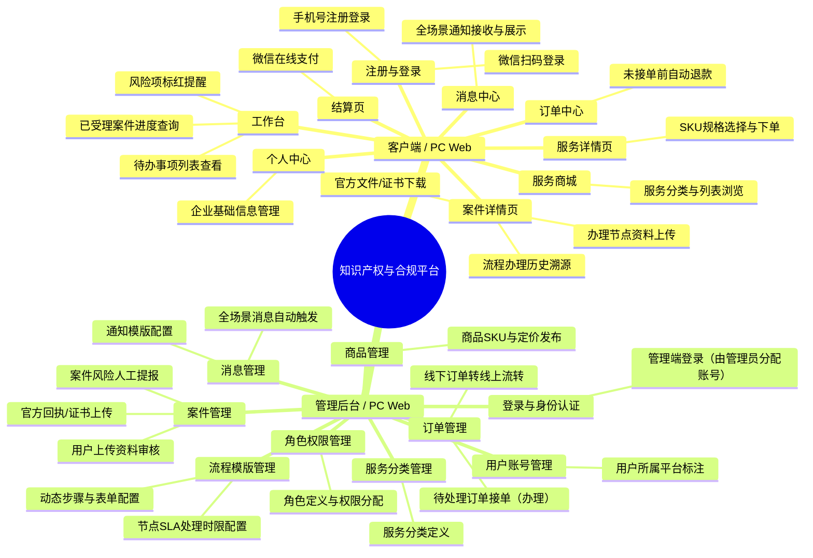

# Product Overview

## 0.文档状态

<table>
  <tr><td>文档类型</td><td>Release</td></tr>
  <tr><td>文档版本</td><td>V11</td></tr>
  <tr><td>生成日期</td><td>2026-05-15</td></tr>
</table>

## 1.产品综合介绍

### 1.1.产品定位

面向全球的一站式合规服务平台，旨在实现知识产权（商标、专利、版权）及各类合规服务（VAT、EPR、工商、产品合规）的在线成交与案件流程可视化交付，解决出海全链路合规痛点。

### 1.2.核心业务目标

1. **交付可视化**：将传统线下的案件流程标准化、数字化，实现进度实时更新、透明可追溯。
2. **灵活配置**：通过动态流程模版与表单配置，快速适配不同国家、不同类别的合规服务需求。
3. **降本增效**：通过系统化的待办提醒与风险预警（人工提报），提升业务员处理案件的效率与准确性。
4. **多品牌运营**：支持一套后台管理两个前端域名（品牌），实现业务数据的集中化管理与前端展示的品牌隔离。

### 1.3.核心用户路径

1. **用户侧（客户）**：账号注册/登录 -> 浏览服务详情/SKU定价 -> 确认订单并支付 -> **待业务员确认接单（此阶段可申请自动退款）** -> 业务员接单后进入办理流程（不可退款） -> 追踪办理进度 -> 交互资料 -> 获取交付成果。
2. **管理侧（业务员/管理员）**：**账号登录（由管理员统一分配，无需注册）** -> 配置服务流程模版 -> 关联SKU发布服务 -> **在待处理订单中点击“办理”接单（接单后进入个人案件列表）** -> 推进案件节点（审核/下发/提报风险） -> 维护系统运行。

### 1.4.页面范围

1. **用户端**：首页/服务商城、服务详情页、下单结算页、工作台（待办/风险/进度）、订单列表（含申请退款）、服务办理列表、服务办理详情页（流程时间轴/资料交互）、消息中心、个人/公司设置。
2. **管理端**：登录页、工作台（数据概览/预警）、用户账号管理、角色权限管理、服务分类管理、商品管理（SKU/定价）、流程模版管理（动态步骤/表单/SLA）、订单管理（待接单/已确认/线下转线上）、案件管理（个人案件列表/进度跟踪/资料审核/风险提报）、消息模版与发送（系统/短信/邮件）、系统协议管理。

### 1.5.功能范围

- **交易与支付**：多SKU定价体系、微信支付集成、订单预处理状态追踪、**售前自动退款机制（接单前可一键自动退款）**、线下订单转线上流程。
- **动态流程交付**：动态步骤配置、自定义步骤表单（文本/下拉/日期/附件等）、步骤责任人指派、节点处理时限（SLA）监控。
- **交互与协作**：双端资料互传、官件下发、审核反馈（通过/驳回）、操作日志溯源。
- **运营与风控**：多域名前端适配（双品牌）、人工风险提报与标红提醒。
- **全场景消息通知**：集成系统站内信、短信、邮件，覆盖账号认证、服务购买、订单支付、订单发货（接单）、订单完成、订单退款、案件审核、案件交付、案件失败、案件成功、状态预警（即将到期/已到期）及系统公告等关键节点。

### 1.6.角色与权限

1. **客户（用户）**：浏览、购买、**申请自动退款（接单前）**、管理自有案件与订单、接收通知、维护企业资料。
2. **录入专员（业务员）**：**接单办理（将订单转为个人名下案件）**、负责具体的案件办理、资料审核、风险提报、服务/商品维护（受限权限）。
3. **超级管理员**：拥有系统全量权限，负责核心架构、权限分配及全局参数维护。

### 1.7.关键操作

- **管理端账号分发**：超级管理员统一为录入专员及其他管理人员分配账号，不提供公开注册入口。
- **动态模版创建**：管理员为不同服务创建包含多个步骤的流程，定义每个步骤的填写项（动态表单）及超时时间。
- **订单接单确认**：业务员在待处理订单列表中点击“办理”按钮，系统将订单流转为案件并分配给该业务员，此操作后订单进入不可退款状态。
- **用户自动退款**：在业务员接单前，用户可在订单中心发起退款申请，系统自动执行原路退回，无需人工干预。
- **人工风险提报**：业务员在巡检案件时，对存在风险的案件手动打标，并在用户工作台实时预警。
- **线下订单转线上**：管理端代客户创单并关联已发布服务，完成后自动流转至已付款并由后台接单状态。

### 1.8.商业化与运营能力

- **多品牌隔离**：支持双域名访问，账号不互通，后端数据结构统一（通过平台标记隔离）。
- **灵活计费与退款**：基于SKU的动态定价与灵活增减；支持接单前的全自动退款流程。
- **全场景消息触达**：支持系统、短信、邮件三端同步，覆盖从账号认证、交易支付到案件办理全生命周期的关键节点提醒与预警。

## 2.产品设计概览

### 2.1.产品端与形态综述

1. **客户端 / PC Web**：主要面向有合规需求的企业用户，提供服务浏览、下单、自动退款申请及进度追踪的核心功能。支持双域名部署以适配不同品牌需求。明确不提供 H5 版本。
2. **管理后台 / PC Web**：面向内部业务员及管理员，提供强大的流程配置、订单确认（接单）、自动退款监控及案件交付全链路管理能力。账号由系统统一分配。

### 2.2.产品端与形态思维导图

### 2.3.产品端与形态表

| ID | 端 | 形态 | 用户角色 | 核心场景 | 功能点 | 页面/模块 | 权限/数据边界 | 来源/依据 | 备注/关联待确认ID |
|---|---|---|---|---|---|---|---|---|---|
| PEF-001 | 客户端 | PC Web | 客户 | 账号访问 | 手机号注册登录 | 登录注册页 | 仅限个人数据 | 商务文档 |  |
| PEF-002 | 客户端 | PC Web | 客户 | 账号访问 | 微信扫码登录 | 登录注册页 | 仅限个人数据 | 商务文档 |  |
| PEF-003 | 客户端 | PC Web | 客户 | 任务处理 | 待办事项列表查看 | 工作台 | 仅限个人待办 | 商务文档 |  |
| PEF-004 | 客户端 | PC Web | 客户 | 任务处理 | 风险项标红提醒 | 工作台 | 仅限个人风险 | 补充业务逻辑 |  |
| PEF-005 | 客户端 | PC Web | 客户 | 交易处理 | 未接单前自动退款 | 订单中心 | 仅限个人订单 | 用户回复 | 系统原路退回 |
| PEF-006 | 客户端 | PC Web | 客户 | 进度追踪 | 已受理案件进度查询 | 工作台/案件中心 | 仅限个人案件 | 补充业务逻辑 | 服务状态入口 |
| PEF-007 | 客户端 | PC Web | 客户 | 服务采购 | 服务分类与列表浏览 | 服务商城 | 品牌隔离展示 | 商务文档 |  |
| PEF-008 | 客户端 | PC Web | 客户 | 服务采购 | SKU规格选择与下单 | 服务详情页 | 品牌隔离定价 | 补充业务逻辑 |  |
| PEF-009 | 客户端 | PC Web | 客户 | 服务采购 | 微信在线支付 | 结算页 | 仅限自有订单 | 商务文档 |  |
| PEF-010 | 客户端 | PC Web | 客户 | 案件办理 | 办理节点资料上传 | 案件详情页 | 节点责任人控制 | 商务文档 | 动态表单交互 |
| PEF-011 | 客户端 | PC Web | 客户 | 案件办理 | 官方文件/证书下载 | 案件详情页 | 仅限该案件 | 商务文档 |  |
| PEF-012 | 客户端 | PC Web | 客户 | 案件办理 | 流程办理历史溯源 | 案件详情页 | 仅限该案件 | 商务文档 |  |
| PEF-013 | 客户端 | PC Web | 客户 | 企业维护 | 企业基础信息管理 | 个人中心 | 仅限个人/所属公司 | 商务文档 |  |
| PEF-014 | 客户端 | PC Web | 客户 | 消息触达 | 全场景通知接收与展示 | 消息中心 | 仅限个人通知 | 用户补充说明 | 覆盖交易、案件、系统公告等 |
| PEF-015 | 管理后台 | PC Web | 超管 | 权限管理 | 角色定义与权限分配 | 角色权限管理 | 全局配置 | 商务文档 |  |
| PEF-016 | 管理后台 | PC Web | 管理员 | 用户管理 | 用户所属平台标注 | 用户账号管理 | 区分双平台来源 | 商务文档 |  |
| PEF-017 | 管理后台 | PC Web | 管理员 | 服务配置 | 服务分类定义 | 服务分类管理 | 全局配置 | 商务文档 |  |
| PEF-018 | 管理后台 | PC Web | 管理员 | 服务配置 | 商品SKU与定价发布 | 商品管理 | 全局配置 | 补充业务逻辑 |  |
| PEF-019 | 管理后台 | PC Web | 管理员 | 流程定义 | 动态步骤与表单配置 | 流程模版管理 | 全局配置 | 补充业务逻辑 |  |
| PEF-020 | 管理后台 | PC Web | 管理员 | 流程定义 | 节点SLA处理时限配置 | 流程模版管理 | 全局配置 | 补充业务逻辑 |  |
| PEF-021 | 管理后台 | PC Web | 录入专员 | 订单处理 | 待处理订单接单（办理） | 订单管理 | 分配至个人名下 | 用户补充说明 | 接单后不可退款 |
| PEF-022 | 管理后台 | PC Web | 录入专员 | 订单处理 | 线下订单转线上流转 | 订单管理 | 全局订单 | 补充业务逻辑 | 管理员代创单 |
| PEF-023 | 管理后台 | PC Web | 录入专员 | 案件交付 | 用户上传资料审核 | 案件管理 | 仅限接单人 | 商务文档 | 通过/驳回操作 |
| PEF-024 | 管理后台 | PC Web | 录入专员 | 案件交付 | 官方回执/证书上传 | 案件管理 | 仅限接单人 | 商务文档 |  |
| PEF-025 | 管理后台 | PC Web | 录入专员 | 异常干预 | 案件风险人工提报 | 案件管理 | 全局监控 | 补充业务逻辑 |  |
| PEF-026 | 管理后台 | PC Web | 管理员 | 消息触达 | 通知模版配置 | 消息管理 | 全局配置 | 用户回复 | 覆盖系统、短信、邮件 |
| PEF-027 | 管理后台 | PC Web | 管理员 | 消息触达 | 全场景消息自动触发 | 消息管理 | 全局监控 | 用户补充说明 | 根据订单、案件状态自动触发 |
| PEF-028 | 管理后台 | PC Web | 录入专员/管理员 | 账号访问 | 管理端登录（管理员分配账号） | 登录页 | 仅限授权人员 | 用户补充说明 | 无需注册 |
