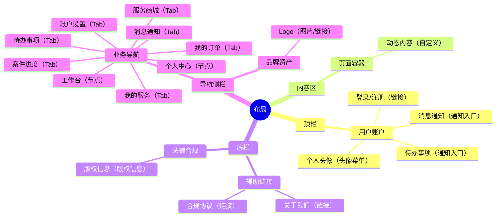
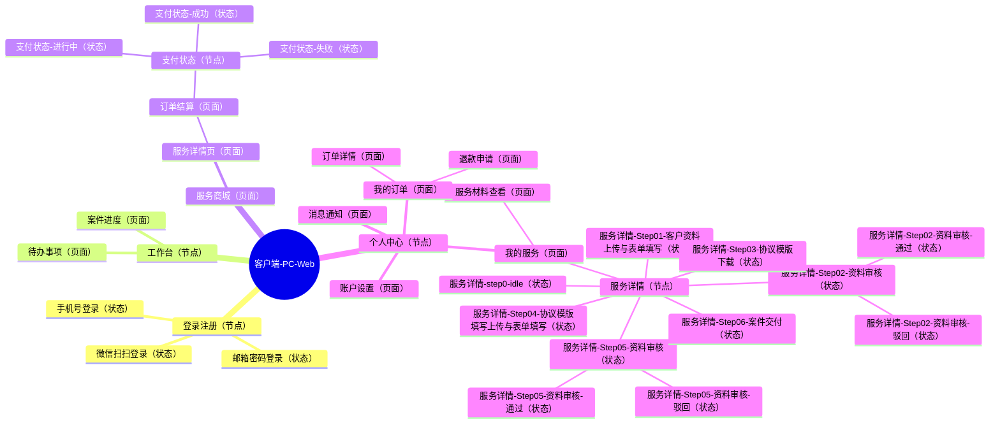

# 客户端-PC-Web Sitemap

## 0.文档状态

<table>
  <tr><td>文档类型</td><td>Development</td></tr>
  <tr><td>文档版本</td><td>V20</td></tr>
  <tr><td>生成日期</td><td>2026-05-17</td></tr>
  <tr><td>产品端与形态</td><td>客户端 / PC Web</td></tr>
</table>

## 1.layout布局方式

### 1.1.布局方式说明

客户端 / PC Web 采用标准的门户类布局：
- **顶栏**：包含个人中心入口、消息通知入口及待办任务入口。
- **内容区**：根据具体页面展示核心业务内容（如商城列表、详情表单、工作台看板等）。
- **底栏**：包含关于我们、联系方式、友情链接及版权信息。
- **导航侧栏**：在用户登录后的工作台、服务商城、案件管理、订单管理页面，提供品牌 Logo 及多层级业务导航。

### 1.2.区域、分组与元素

| 区域ID | 区域 | Group ID | 分组 | Element ID | 元素 | 类型 | 说明 |
|---|---|---|---|---|---|---|---|
| LYT-001 | 顶栏 | LYG-003 | 用户账户 | LYE-004 | 个人头像 | 头像菜单 | |
| LYT-001 | 顶栏 | LYG-003 | 用户账户 | LYE-003 | 消息通知 | 通知入口 | |
| LYT-001 | 顶栏 | LYG-003 | 用户账户 | LYE-014 | 待办事项 | 通知入口 | |
| LYT-001 | 顶栏 | LYG-003 | 用户账户 | LYE-005 | 登录/注册 | 链接 | |
| LYT-002 | 内容区 | LYG-004 | 页面容器 | LYE-006 | 动态内容 | 自定义 | |
| LYT-003 | 底栏 | LYG-005 | 辅助链接 | LYE-007 | 关于我们 | 链接 | |
| LYT-003 | 底栏 | LYG-005 | 辅助链接 | LYE-008 | 合规协议 | 链接 | |
| LYT-003 | 底栏 | LYG-006 | 法律合规 | LYE-009 | 版权信息 | 版权信息 | |
| LYT-004 | 导航侧栏 | LYG-001 | 品牌资产 | LYE-001 | Logo | 图片/链接 | 点击返回首页。 |
| LYT-004 | 导航侧栏 | LYG-007 | 业务导航 | LYE-010 | 工作台 | 节点 | |
| LYT-004 | 导航侧栏 | LYG-007 | 业务导航 | LYE-015 | 待办事项 | Tab | |
| LYT-004 | 导航侧栏 | LYG-007 | 业务导航 | LYE-016 | 案件进度 | Tab | |
| LYT-004 | 导航侧栏 | LYG-007 | 业务导航 | LYE-011 | 服务商城 | Tab | |
| LYT-004 | 导航侧栏 | LYG-007 | 业务导航 | LYE-017 | 个人中心 | 节点 | |
| LYT-004 | 导航侧栏 | LYG-007 | 业务导航 | LYE-018 | 消息通知 | Tab | |
| LYT-004 | 导航侧栏 | LYG-007 | 业务导航 | LYE-019 | 我的服务 | Tab | |
| LYT-004 | 导航侧栏 | LYG-007 | 业务导航 | LYE-020 | 我的订单 | Tab | |
| LYT-004 | 导航侧栏 | LYG-007 | 业务导航 | LYE-021 | 账户设置 | Tab | |

## 2.sitemap站点/APP地图

### 2.1.sitemap思维导图

### 2.2.页面清单

| ID | 父级ID | 层级 | 页面/模块 | 页面类型 | 状态组 | 用户角色 | 核心场景 | 来源PEF-ID | 备注/关联待确认ID |
|---|---|---|---|---|---|---|---|---|---|
| PAGE-001 |  | 1 | 登录注册 | 节点 |  | 客户 | 账号访问 | PEF-001, PEF-002 | 按思维导图优先调整为节点；登录方式由子状态页承载。 |
| PAGE-002 | PAGE-001 | 2 | 手机号登录 | 状态 | STATE-001 | 客户 | 账号访问 | PEF-001 |  |
| PAGE-034 | PAGE-001 | 2 | 邮箱密码登录 | 状态 | STATE-001 | 客户 | 账号访问 | PEF-001 |  |
| PAGE-003 | PAGE-001 | 2 | 微信扫扫登录 | 状态 | STATE-001 | 客户 | 账号访问 | PEF-002 | 按思维导图文本同步。 |
| PAGE-007 |  | 1 | 工作台 | 节点 |  | 客户 | 任务处理 | PEF-003, PEF-004, PEF-006 |  |
| PAGE-008 | PAGE-007 | 2 | 待办事项 | 页面 |  | 客户 | 任务处理 | PEF-003, PEF-004 |  |
| PAGE-009 | PAGE-007 | 2 | 案件进度 | 页面 |  | 客户 | 进度追踪 | PEF-006 |  |
| PAGE-004 |  | 1 | 服务商城 | 页面 |  | 客户 | 服务采购 | PEF-007 | |
| PAGE-005 | PAGE-004 | 2 | 服务详情页 | 页面 |  | 客户 | 服务采购 | PEF-008 | |
| PAGE-006 | PAGE-005 | 3 | 订单结算 | 页面 |  | 客户 | 服务采购 | PEF-009 | 按思维导图优先保留为页面。 |
| PAGE-055 | PAGE-006 | 4 | 支付状态 | 节点 |  | 客户 | 服务采购 | PEF-009 | 按思维导图优先调整为节点；支付结果由子状态页承载。 |
| PAGE-036 | PAGE-055 | 5 | 支付状态-进行中 | 状态 | STATE-003 | 客户 | 服务采购 | PEF-009 | 状态组名称：支付状态 |
| PAGE-037 | PAGE-055 | 5 | 支付状态-成功 | 状态 | STATE-003 | 客户 | 服务采购 | PEF-009 | 状态组名称：支付状态 |
| PAGE-038 | PAGE-055 | 5 | 支付状态-失败 | 状态 | STATE-003 | 客户 | 服务采购 | PEF-009 | 状态组名称：支付状态 |
| PAGE-014 |  | 1 | 个人中心 | 节点 |  | 客户 | 企业维护 | PEF-013 |  |
| PAGE-015 | PAGE-014 | 2 | 消息通知 | 页面 |  | 客户 | 消息触达 | PEF-014 |  |
| PAGE-039 | PAGE-014 | 2 | 我的服务 | 页面 |  | 客户 | 进度追踪 | PEF-006 | 按思维导图优先保留为页面。 |
| PAGE-040 | PAGE-039 | 3 | 服务材料查看 | 页面 |  | 客户 | 案件办理 | PEF-011 | 呈现形式：弹窗 |
| PAGE-056 | PAGE-039 | 3 | 服务详情 | 页面 |  | 客户 | 案件办理 | PEF-010, PEF-011 | 按思维导图优先补齐为页面，并承载服务详情状态组。 |
| PAGE-041 | PAGE-056 | 4 | 服务详情-Step01-客户资料上传与表单填写 | 状态 | STATE-004 | 客户 | 案件办理 | PEF-010 | 状态组名称：服务详情流程 |
| PAGE-042 | PAGE-056 | 4 | 服务详情-Step02-资料审核 | 状态 | STATE-004 | 客户 | 案件办理 | PEF-010 | 状态组名称：服务详情流程 |
| PAGE-043 | PAGE-042 | 5 | 服务详情-Step02-资料审核-通过 | 状态 | STATE-004 | 客户 | 案件办理 | PEF-010 | 状态组名称：服务详情流程 |
| PAGE-044 | PAGE-042 | 5 | 服务详情-Step02-资料审核-驳回 | 状态 | STATE-004 | 客户 | 案件办理 | PEF-010 | 状态组名称：服务详情流程 |
| PAGE-045 | PAGE-056 | 4 | 服务详情-Step03-协议模版下载 | 状态 | STATE-004 | 客户 | 案件办理 | PEF-011 | 状态组名称：服务详情流程 |
| PAGE-046 | PAGE-056 | 4 | 服务详情-Step04-协议模版填写上传与表单填写 | 状态 | STATE-004 | 客户 | 案件办理 | PEF-010 | 状态组名称：服务详情流程 |
| PAGE-047 | PAGE-056 | 4 | 服务详情-Step05-资料审核 | 状态 | STATE-004 | 客户 | 案件办理 | PEF-010 | 状态组名称：服务详情流程 |
| PAGE-048 | PAGE-047 | 5 | 服务详情-Step05-资料审核-通过 | 状态 | STATE-004 | 客户 | 案件办理 | PEF-010 | 状态组名称：服务详情流程 |
| PAGE-049 | PAGE-047 | 5 | 服务详情-Step05-资料审核-驳回 | 状态 | STATE-004 | 客户 | 案件办理 | PEF-010 | 状态组名称：服务详情流程 |
| PAGE-050 | PAGE-056 | 4 | 服务详情-Step06-案件交付 | 状态 | STATE-004 | 客户 | 案件办理 | PEF-011 | 状态组名称：服务详情流程 |
| PAGE-054 | PAGE-056 | 4 | 服务详情-step0-idle | 状态 | STATE-004 | 客户 | 案件办理 | PEF-010 | 状态组名称：服务详情流程 |
| PAGE-051 | PAGE-014 | 2 | 我的订单 | 页面 |  | 客户 | 交易处理 | PEF-005 | 按思维导图优先保留为页面。 |
| PAGE-052 | PAGE-051 | 3 | 订单详情 | 页面 |  | 客户 | 交易处理 | PEF-005 | 呈现形式：弹窗 |
| PAGE-012 | PAGE-051 | 3 | 退款申请 | 页面 |  | 客户 | 交易处理 | PEF-005 | 呈现形式：弹窗 |
| PAGE-053 | PAGE-014 | 2 | 账户设置 | 页面 |  | 客户 | 企业维护 | PEF-013 |  |

## 3.待确认与假设

- C-000【待确认】
  - 内容：暂无待确认项。
  - 影响范围：无。
  - 用户回复：

## 4.用户补充说明

用户可在此补充新的 sitemap 想法、确认项修改或页面范围调整：
