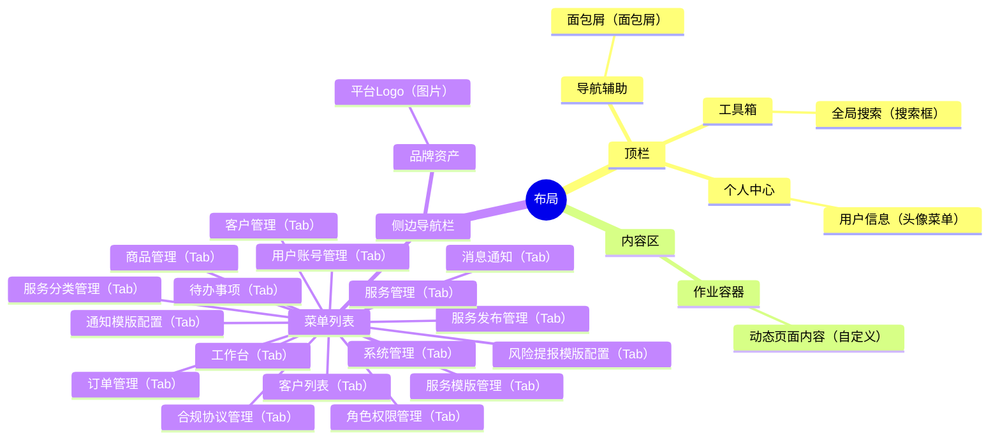
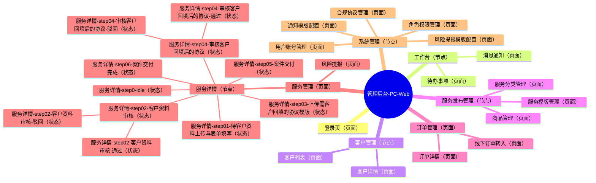

# 管理后台-PC-Web Sitemap

## 0.文档状态

<table>
  <tr><td>文档类型</td><td>Development</td></tr>
  <tr><td>文档版本</td><td>V15</td></tr>
  <tr><td>生成日期</td><td>2026-05-17</td></tr>
  <tr><td>产品端与形态</td><td>管理后台 / PC Web</td></tr>
</table>

## 1.layout布局方式

### 1.1.布局方式说明

管理后台 / PC Web 采用标准的企业级中台布局：
- **侧边导航栏**：常驻页面左侧，提供多级功能菜单。
- **顶栏**：包含折叠侧栏按钮、面包屑导航、全局搜索、当前登录用户及退出操作。
- **内容区**：展示业务表格、统计看板、详情表单等主要作业内容。
- **全局工具**（可选）：悬浮或固定在页面边缘的常用快捷工具。

### 1.2.区域、分组与元素

| 区域ID | 区域 | Group ID | 分组 | Element ID | 元素 | 类型 | 说明 |
|---|---|---|---|---|---|---|---|
| LYT-001 | 顶栏 | LYG-001 | 导航辅助 | LYE-001 | 面包屑 | 面包屑 | 展示当前页面层级路径。 |
| LYT-001 | 顶栏 | LYG-002 | 工具箱 | LYE-002 | 全局搜索 | 搜索框 | 快捷搜索订单、案件或用户。 |
| LYT-001 | 顶栏 | LYG-003 | 个人中心 | LYE-003 | 用户信息 | 头像菜单 | 显示当前管理员姓名，支持退出登录。 |
| LYT-002 | 内容区 | LYG-004 | 作业容器 | LYE-004 | 动态页面内容 | 自定义 | 业务功能展示区。 |
| LYT-003 | 侧边导航栏 | LYG-005 | 品牌资产 | LYE-005 | 平台Logo | 图片 | 固定展示系统 Logo。 |
| LYT-003 | 侧边导航栏 | LYG-006 | 菜单列表 | LYE-006 | 工作台 | Tab | 包含待办事项与消息通知。 |
| LYT-003 | 侧边导航栏 | LYG-006 | 菜单列表 | LYE-012 | 待办事项 | Tab | |
| LYT-003 | 侧边导航栏 | LYG-006 | 菜单列表 | LYE-013 | 消息通知 | Tab | |
| LYT-003 | 侧边导航栏 | LYG-006 | 菜单列表 | LYE-007 | 客户管理 | Tab | 包含客户列表与详情。 |
| LYT-003 | 侧边导航栏 | LYG-006 | 菜单列表 | LYE-014 | 客户列表 | Tab | |
| LYT-003 | 侧边导航栏 | LYG-006 | 菜单列表 | LYE-008 | 服务发布管理 | Tab | 包含分类、模版与商品管理。 |
| LYT-003 | 侧边导航栏 | LYG-006 | 菜单列表 | LYE-015 | 服务分类管理 | Tab | |
| LYT-003 | 侧边导航栏 | LYG-006 | 菜单列表 | LYE-016 | 服务模版管理 | Tab | |
| LYT-003 | 侧边导航栏 | LYG-006 | 菜单列表 | LYE-017 | 商品管理 | Tab | |
| LYT-003 | 侧边导航栏 | LYG-006 | 菜单列表 | LYE-009 | 订单管理 | Tab | 订单处理入口。 |
| LYT-003 | 侧边导航栏 | LYG-006 | 菜单列表 | LYE-010 | 服务管理 | Tab | 案件办理与进度管控。 |
| LYT-003 | 侧边导航栏 | LYG-006 | 菜单列表 | LYE-011 | 系统管理 | Tab | 配置、权限、账号与协议。 |
| LYT-003 | 侧边导航栏 | LYG-006 | 菜单列表 | LYE-018 | 通知模版配置 | Tab | |
| LYT-003 | 侧边导航栏 | LYG-006 | 菜单列表 | LYE-019 | 风险提报模版配置 | Tab | |
| LYT-003 | 侧边导航栏 | LYG-006 | 菜单列表 | LYE-020 | 角色权限管理 | Tab | |
| LYT-003 | 侧边导航栏 | LYG-006 | 菜单列表 | LYE-021 | 用户账号管理 | Tab | |
| LYT-003 | 侧边导航栏 | LYG-006 | 菜单列表 | LYE-022 | 合规协议管理 | Tab | |

## 2.sitemap站点/APP地图

### 2.1.sitemap思维导图

### 2.2.页面清单

| ID | 父级ID | 层级 | 页面/模块 | 页面类型 | 状态组 | 用户角色 | 核心场景 | 来源PEF-ID | 备注/关联待确认ID |
|---|---|---|---|---|---|---|---|---|---|
| PAGE-016 |  | 1 | 登录页 | 页面 |  | 录入专员/管理员 | 账号访问 | PEF-028 |  |
| PAGE-017 |  | 1 | 工作台 | 节点 |  | 录入专员/管理员 | 任务处理 | PEF-021, PEF-025 |  |
| PAGE-018 | PAGE-017 | 2 | 待办事项 | 页面 |  | 录入专员/管理员 | 任务处理 | PEF-021 |  |
| PAGE-019 | PAGE-017 | 2 | 消息通知 | 页面 |  | 录入专员/管理员 | 消息触达 | PEF-027 |  |
| PAGE-020 |  | 1 | 客户管理 | 节点 |  | 管理员 | 客户管理 | PEF-016 |  |
| PAGE-021 | PAGE-020 | 2 | 客户列表 | 页面 |  | 管理员 | 客户管理 | PEF-016 |  |
| PAGE-022 | PAGE-020 | 2 | 客户详情 | 页面 |  | 管理员 | 客户管理 | PEF-016 |  |
| PAGE-023 |  | 1 | 服务发布管理 | 节点 |  | 管理员 | 服务配置 | PEF-017, PEF-018, PEF-019 |  |
| PAGE-024 | PAGE-023 | 2 | 服务分类管理 | 页面 |  | 管理员 | 服务配置 | PEF-017 |  |
| PAGE-025 | PAGE-023 | 2 | 服务模版管理 | 页面 |  | 管理员 | 流程定义 | PEF-019, PEF-020 |  |
| PAGE-026 | PAGE-023 | 2 | 商品管理 | 页面 |  | 管理员 | 服务配置 | PEF-018 |  |
| PAGE-027 |  | 1 | 订单管理 | 页面 |  | 录入专员 | 订单处理 | PEF-021, PEF-022 | 按思维导图优先保留为页面。 |
| PAGE-029 | PAGE-027 | 2 | 订单详情 | 页面 |  | 录入专员 | 订单处理 | PEF-021 | 按思维导图优先；由旧弹窗类型规范化为页面。 |
| PAGE-030 | PAGE-027 | 2 | 线下订单转入 | 页面 |  | 录入专员 | 订单处理 | PEF-022 | 按思维导图优先；由旧弹窗类型规范化为页面。 |
| PAGE-052 |  | 1 | 服务管理 | 页面 |  | 录入专员 | 案件交付 | PEF-023, PEF-024, PEF-025 | 按思维导图优先保留为页面。 |
| PAGE-053 | PAGE-052 | 2 | 服务详情 | 页面 |  | 录入专员 | 案件交付 | PEF-023, PEF-024 | 按思维导图优先补齐为页面，并承载服务详情状态组。 |
| PAGE-044 | PAGE-053 | 3 | 服务详情-step0-idle | 状态 | STATE-010 | 录入专员 | 案件交付 | PEF-023 | 状态组名称：服务详情流程；按思维导图优先保留首个 idle 状态。 |
| PAGE-034 | PAGE-053 | 3 | 服务详情-step01-待客户资料上传与表单填写 | 状态 | STATE-010 | 录入专员 | 案件交付 | PEF-023 | 状态组名称：服务详情流程 |
| PAGE-035 | PAGE-053 | 3 | 服务详情-step02-客户资料审核 | 状态 | STATE-010 | 录入专员 | 案件交付 | PEF-023 | 状态组名称：服务详情流程 |
| PAGE-036 | PAGE-035 | 4 | 服务详情-step02-客户资料审核-通过 | 状态 | STATE-010 | 录入专员 | 案件交付 | PEF-023 | 状态组名称：服务详情流程 |
| PAGE-037 | PAGE-035 | 4 | 服务详情-step02-客户资料审核-驳回 | 状态 | STATE-010 | 录入专员 | 案件交付 | PEF-023 | 状态组名称：服务详情流程 |
| PAGE-038 | PAGE-053 | 3 | 服务详情-step03-上传需客户回填的协议模版 | 状态 | STATE-010 | 录入专员 | 案件交付 | PEF-024 | 状态组名称：服务详情流程 |
| PAGE-039 | PAGE-053 | 3 | 服务详情-step04-审核客户回填后的协议 | 状态 | STATE-010 | 录入专员 | 案件交付 | PEF-023 | 状态组名称：服务详情流程 |
| PAGE-040 | PAGE-039 | 4 | 服务详情-step04-审核客户回填后的协议-通过 | 状态 | STATE-010 | 录入专员 | 案件交付 | PEF-023 | 状态组名称：服务详情流程 |
| PAGE-041 | PAGE-039 | 4 | 服务详情-step04-审核客户回填后的协议-驳回 | 状态 | STATE-010 | 录入专员 | 案件交付 | PEF-023 | 状态组名称：服务详情流程 |
| PAGE-042 | PAGE-053 | 3 | 服务详情-step05-案件交付 | 状态 | STATE-010 | 录入专员 | 案件交付 | PEF-024 | 状态组名称：服务详情流程 |
| PAGE-043 | PAGE-053 | 3 | 服务详情-step06-案件交付完成 | 状态 | STATE-010 | 录入专员 | 案件交付 | PEF-024 | 状态组名称：服务详情流程 |
| PAGE-045 | PAGE-052 | 2 | 风险提报 | 页面 |  | 录入专员 | 异常干预 | PEF-025 | 按思维导图优先；由旧弹窗类型规范化为页面。 |
| PAGE-046 |  | 1 | 系统管理 | 节点 |  | 超管/管理员 | 权限管理 | PEF-015, PEF-016, PEF-026 |  |
| PAGE-047 | PAGE-046 | 2 | 通知模版配置 | 页面 |  | 管理员 | 消息触达 | PEF-026 |  |
| PAGE-048 | PAGE-046 | 2 | 风险提报模版配置 | 页面 |  | 管理员 | 异常干预 | PEF-025 |  |
| PAGE-049 | PAGE-046 | 2 | 角色权限管理 | 页面 |  | 超管 | 权限管理 | PEF-015 |  |
| PAGE-050 | PAGE-046 | 2 | 用户账号管理 | 页面 |  | 管理员 | 用户管理 | PEF-016 |  |
| PAGE-051 | PAGE-046 | 2 | 合规协议管理 | 页面 |  | 管理员 | 协议管理 | PEF-017 |  |

## 3.待确认与假设

- C-000【待确认】
  - 内容：暂无待确认项。
  - 影响范围：无。
  - 用户回复：

## 4.用户补充说明

用户可在此补充新的 sitemap 想法、确认项修改或页面范围调整：
