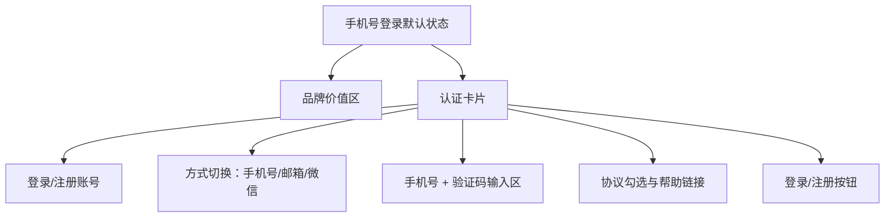

# 手机号登录 Page Layout

## 0.文档状态

<table>
  <tr><td>文档类型</td><td>Development</td></tr>
  <tr><td>文档版本</td><td>V1</td></tr>
  <tr><td>生成日期</td><td>2026-05-18</td></tr>
  <tr><td>来源Sitemap</td><td>product/layout/客户端-PC-Web-sitemap.md</td></tr>
  <tr><td>使用Layout</td><td>客户端 / PC Web</td></tr>
  <tr><td>页面清单ID</td><td>PAGE-002</td></tr>
  <tr><td>状态组</td><td>STATE-001</td></tr>
</table>

## 1.页面布局说明

### 1.1.页面目标与范围

手机号登录是客户端 PC Web 登录注册状态组的默认入口，支持客户使用手机号与短信验证码完成登录或注册。页面只描述登录页本体，不展开全局顶栏、底栏和未登录入口；后续 pm06 需从来源 sitemap 合并全局 layout。

### 1.2.使用的layout与状态

| 引用项 | 值 | 说明 |
|---|---|---|
| 来源Sitemap | product/layout/客户端-PC-Web-sitemap.md | 后续 skill 需要合并全局壳时，应回读该 sitemap。 |
| 使用Layout | 客户端 / PC Web | 仅作为 layout 引用，不在当前页面文档中展开顶栏、侧栏、底栏等全局元素。 |
| 页面挂载上下文 | 登录注册 > 手机号登录 | PAGE-001 为节点，当前 PAGE-002 为 STATE-001 登录状态页。 |
| 全局Layout读取位置 | 来源Sitemap `1.layout布局方式` 与 `1.2.区域、分组与元素` | 当前文档专注页面本体，后续合并分析时再读取全局 layout。 |

### 1.3.完整页面内容

#### 1.3.1.默认状态页面结构

- 品牌价值区：展示平台名称“Case Tracking Portal”、一句价值说明“全球合规服务进度可视化交付”、三项能力标签“服务购买 / 案件追踪 / 消息触达”。
- 认证卡片：标题“登录/注册账号”，副标题“使用手机号接收验证码后继续”。
- 登录方式切换：三段式选项“手机号 / 邮箱 / 微信”，当前激活“手机号”。
- 凭证输入区：手机号输入框、短信验证码输入框与“获取验证码”按钮。
- 协议与帮助：勾选“我已阅读并同意服务协议、隐私政策”，辅助链接“邮箱登录”“微信扫码登录”“遇到问题？”。
- 主操作：蓝色主按钮“登录/注册”，默认可点击。

#### 1.3.2.默认状态元素细节

默认状态下所有控件均为未填写但可输入。手机号字段占位为“请输入手机号”，短信验证码字段占位为“请输入6位验证码”，获取验证码按钮位于验证码输入框右侧。

#### 1.3.3.状态清单

| 状态ID | 状态名称 | 状态类型 | 触发条件 | 影响区域/元素 | 是否默认状态 | 布局处理方式 |
|---|---|---|---|---|---|---|
| STATE-VIEW-001 | 默认状态 | 页面视图状态 | 首次进入手机号登录 | 全页面默认结构 | 是 | 完整页面基线 |
| STATE-VIEW-002 | 表单校验错误 | 表单状态 | 手机号或验证码格式错误 | 输入框/helper | 否 | 记录差异，不生成独立 Figma 节点 |
| STATE-VIEW-003 | 验证码发送中 | 操作状态 | 点击获取验证码 | 获取验证码按钮 | 否 | 记录差异，不生成独立 Figma 节点 |

#### 1.3.4.状态差异说明

非默认状态只改变局部提示、按钮倒计时或错误文字；不改变认证卡片尺寸、切换区位置、主按钮位置和整体布局。

### 1.4.默认状态页面结构图

### 1.5.页面元素清单

| ID | 元素来源 | 区域 | Group ID | 分组 | Element ID | 元素 | 类型 | 状态/数据分类 | 是否状态差异元素 | 状态差异说明 | 数据来源 | 交互/校验规则 | 备注/关联待确认ID |
|---|---|---|---|---|---|---|---|---|---|---|---|---|---|
| PLE-001 | Page Content | 内容区 | PGR-001 | 品牌价值区 | PEL-001 | 平台名称 | 文本 | 默认状态 | 否 | 无 | Product Overview | 展示品牌。 |  |
| PLE-002 | Page Content | 内容区 | PGR-001 | 品牌价值区 | PEL-002 | 能力标签 | 标签组 | 默认状态 | 否 | 无 | Product Overview | 展示三项能力标签。 |  |
| PLE-003 | Page Content | 内容区 | PGR-002 | 认证卡片 | PEL-003 | 卡片标题 | 文本 | 默认状态 | 否 | 无 | 页面清单 | 展示“登录/注册账号”。 |  |
| PLE-004 | Page Content | 内容区 | PGR-002 | 认证卡片 | PEL-004 | 登录方式切换 | 分段控件 | 默认状态/手机号激活 | 否 | 无 | STATE-001 | 切换至邮箱或微信状态页。 |  |
| PLE-005 | Page Content | 内容区 | PGR-003 | 凭证输入区 | PEL-005 | 手机号输入框 | 输入框 | 默认状态 | 否 | 无 | 用户输入 | 必填，校验手机号格式。 |  |
| PLE-006 | Page Content | 内容区 | PGR-003 | 凭证输入区 | PEL-006 | 短信验证码输入框 | 输入框 | 默认状态 | 否 | 无 | 用户输入/短信 | 必填，6位数字。 |  |
| PLE-007 | Page Content | 内容区 | PGR-003 | 凭证输入区 | PEL-007 | 获取验证码按钮 | 按钮 | 默认状态 | 是 | 发送中显示倒计时。 | 短信服务 | 点击后发送验证码。 |  |
| PLE-008 | Page Content | 内容区 | PGR-004 | 协议与帮助 | PEL-008 | 协议勾选 | Checkbox | 默认状态 | 否 | 无 | 协议配置 | 未勾选时提交提示。 |  |
| PLE-009 | Page Content | 内容区 | PGR-005 | 主操作 | PEL-009 | 登录/注册按钮 | 按钮 | 默认状态 | 否 | 无 | 账号服务 | 点击提交。 |  |

## 2.Mock数据

### 2.1.数据分类说明

默认状态数据覆盖品牌文案、手机号输入、验证码输入、协议与主按钮。非默认状态仅记录校验与倒计时差异。

### 2.2.Mock数据表

| Mock ID | 关联元素ID | 数据分类 | 字段 | 示例值 | 数据类型 | 适用状态组/页面类型 | 备注 |
|---|---|---|---|---|---|---|---|
| MOCK-001 | PLE-001 | 默认状态数据集 | 平台名称 | Case Tracking Portal | string | STATE-001 | 品牌文案 |
| MOCK-002 | PLE-005 | 默认状态数据集 | 手机号placeholder | 请输入手机号 | string | STATE-001 | 输入占位 |
| MOCK-003 | PLE-006 | 默认状态数据集 | 验证码placeholder | 请输入6位验证码 | string | STATE-001 | 输入占位 |
| MOCK-004 | PLE-007 | 状态差异数据集 | 倒计时 | 59s后重试 | string | STATE-001 | 发送中状态 |

## 3.待确认与假设

- A-001【假设】
  - 内容：手机号登录、邮箱密码登录、微信扫扫登录共用 STATE-001 登录注册状态组基线。
  - 影响范围：三页在 pm06/pm08 中应保持同卡片宽度、同切换区、同主操作位置。
  - 用户回复：

## 4.用户补充说明

用户可在此补充新的页面布局想法、确认项修改或元素范围调整：
