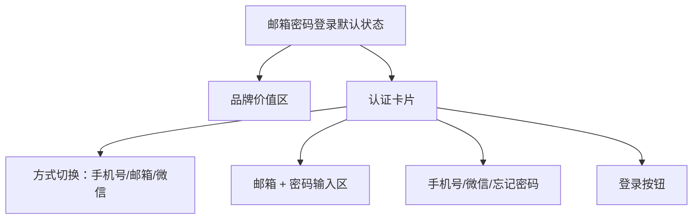

# 邮箱密码登录 Page Layout

## 0.文档状态

<table>
  <tr><td>文档类型</td><td>Development</td></tr>
  <tr><td>文档版本</td><td>V1</td></tr>
  <tr><td>生成日期</td><td>2026-05-18</td></tr>
  <tr><td>来源Sitemap</td><td>product/layout/客户端-PC-Web-sitemap.md</td></tr>
  <tr><td>使用Layout</td><td>客户端 / PC Web</td></tr>
  <tr><td>页面清单ID</td><td>PAGE-034</td></tr>
  <tr><td>状态组</td><td>STATE-001</td></tr>
</table>

## 1.页面布局说明

### 1.1.页面目标与范围

邮箱密码登录是 STATE-001 登录注册状态组中的邮箱凭证状态页，用于已有账号通过邮箱和密码登录。页面复用手机号登录的品牌价值区、认证卡片、方式切换、主操作和辅助链接位置，仅替换凭证输入区内容。

### 1.2.使用的layout与状态

| 引用项 | 值 | 说明 |
|---|---|---|
| 来源Sitemap | product/layout/客户端-PC-Web-sitemap.md | 后续 skill 需要合并全局壳时，应回读该 sitemap。 |
| 使用Layout | 客户端 / PC Web | 仅作为 layout 引用，不在当前页面文档中展开全局元素。 |
| 页面挂载上下文 | 登录注册 > 邮箱密码登录 | PAGE-001 为节点，当前 PAGE-034 为 STATE-001 登录状态页。 |
| 全局Layout读取位置 | 来源Sitemap `1.layout布局方式` 与 `1.2.区域、分组与元素` | 当前文档专注页面本体，后续合并分析时再读取全局 layout。 |

### 1.3.完整页面内容

#### 1.3.1.默认状态页面结构

- 品牌价值区：与 STATE-001 登录组一致，展示平台名称、说明与能力标签。
- 认证卡片：标题“登录账号”，副标题“使用邮箱与密码访问你的服务进度”。
- 登录方式切换：三段式选项“手机号 / 邮箱 / 微信”，当前激活“邮箱”。
- 凭证输入区：邮箱输入框、密码输入框，密码输入框右侧含可见性切换图标。
- 协议与帮助：辅助链接“手机号登录”“微信扫码登录”“忘记密码？”。
- 主操作：蓝色主按钮“登录”。

#### 1.3.2.默认状态元素细节

邮箱字段占位为“请输入邮箱地址”，密码字段占位为“请输入登录密码”。忘记密码链接位于辅助链接区右侧。

#### 1.3.3.状态清单

| 状态ID | 状态名称 | 状态类型 | 触发条件 | 影响区域/元素 | 是否默认状态 | 布局处理方式 |
|---|---|---|---|---|---|---|
| STATE-VIEW-001 | 默认状态 | 页面视图状态 | 首次进入邮箱密码登录 | 全页面默认结构 | 是 | 完整页面基线 |
| STATE-VIEW-002 | 密码错误 | 表单状态 | 登录失败 | 密码输入框/helper | 否 | 记录差异，不生成独立 Figma 节点 |

#### 1.3.4.状态差异说明

密码错误仅展示红色 helper 与错误状态边框，不改变卡片与输入区几何结构。

### 1.4.默认状态页面结构图

### 1.5.页面元素清单

| ID | 元素来源 | 区域 | Group ID | 分组 | Element ID | 元素 | 类型 | 状态/数据分类 | 是否状态差异元素 | 状态差异说明 | 数据来源 | 交互/校验规则 | 备注/关联待确认ID |
|---|---|---|---|---|---|---|---|---|---|---|---|---|---|
| PLE-001 | Page Content | 内容区 | PGR-001 | 品牌价值区 | PEL-001 | 平台名称 | 文本 | 默认状态 | 否 | 无 | Product Overview | 与 STATE-001 保持一致。 |  |
| PLE-002 | Page Content | 内容区 | PGR-002 | 认证卡片 | PEL-002 | 登录方式切换 | 分段控件 | 默认状态/邮箱激活 | 否 | 无 | STATE-001 | 切换至其他登录状态页。 |  |
| PLE-003 | Page Content | 内容区 | PGR-003 | 凭证输入区 | PEL-003 | 邮箱输入框 | 输入框 | 默认状态 | 否 | 无 | 用户输入 | 必填，校验邮箱格式。 |  |
| PLE-004 | Page Content | 内容区 | PGR-003 | 凭证输入区 | PEL-004 | 密码输入框 | 输入框 | 默认状态 | 否 | 错误态显示 helper。 | 用户输入 | 必填，可切换明文。 |  |
| PLE-005 | Page Content | 内容区 | PGR-004 | 辅助链接 | PEL-005 | 忘记密码链接 | 链接 | 默认状态 | 否 | 无 | 账号服务 | 点击进入找回流程。 |  |
| PLE-006 | Page Content | 内容区 | PGR-005 | 主操作 | PEL-006 | 登录按钮 | 按钮 | 默认状态 | 否 | 无 | 账号服务 | 点击提交。 |  |

## 2.Mock数据

### 2.1.数据分类说明

默认状态数据覆盖邮箱、密码、忘记密码与主按钮。错误状态只记录密码错误提示。

### 2.2.Mock数据表

| Mock ID | 关联元素ID | 数据分类 | 字段 | 示例值 | 数据类型 | 适用状态组/页面类型 | 备注 |
|---|---|---|---|---|---|---|---|
| MOCK-001 | PLE-003 | 默认状态数据集 | 邮箱placeholder | 请输入邮箱地址 | string | STATE-001 | 输入占位 |
| MOCK-002 | PLE-004 | 默认状态数据集 | 密码placeholder | 请输入登录密码 | string | STATE-001 | 输入占位 |
| MOCK-003 | PLE-005 | 默认状态数据集 | 忘记密码 | 忘记密码？ | string | STATE-001 | 链接 |
| MOCK-004 | PLE-004 | 状态差异数据集 | 密码错误 | 邮箱或密码不正确 | string | STATE-001 | 错误提示 |

## 3.待确认与假设

- A-001【假设】
  - 内容：邮箱登录复用 STATE-001 登录组基线，仅替换凭证输入区。
  - 影响范围：pm06/pm08 不应为邮箱页重新决定 auth card 尺寸和按钮位置。
  - 用户回复：

## 4.用户补充说明

用户可在此补充新的页面布局想法、确认项修改或元素范围调整：
