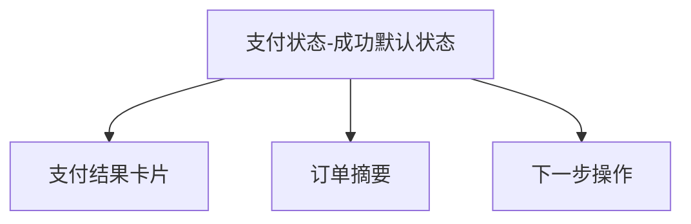

# 支付状态-成功 Page Layout

## 0.文档状态

<table>
  <tr><td>文档类型</td><td>Development</td></tr>
  <tr><td>文档版本</td><td>V1</td></tr>
  <tr><td>生成日期</td><td>2026-05-18</td></tr>
  <tr><td>来源Sitemap</td><td>product/layout/客户端-PC-Web-sitemap.md</td></tr>
  <tr><td>使用Layout</td><td>客户端 / PC Web</td></tr>
  <tr><td>页面清单ID</td><td>PAGE-037</td></tr>
  <tr><td>状态组</td><td>STATE-003</td></tr>
</table>

## 1.页面布局说明

### 1.1.页面目标与范围

支付状态-成功用于订单已支付，系统将等待业务员确认接单。 当前文档只描述页面本体内容，工作台、服务商城和支付状态相关节点仅作为目录和导航上下文，不为节点生成独立 layout.md。

### 1.2.使用的layout与状态

| 引用项 | 值 | 说明 |
|---|---|---|
| 来源Sitemap | product/layout/客户端-PC-Web-sitemap.md | 后续 skill 需要合并全局壳时，应回读该 sitemap。 |
| 使用Layout | 客户端 / PC Web | 当前页面属于客户端登录后工作区，后续 pm06 应合并顶栏、侧栏和内容区。 |
| 页面挂载上下文 | PAGE-055-支付状态 > 支付状态-成功 | 来自 sitemap 页面清单父级链。 |
| 全局Layout读取位置 | 来源Sitemap `1.layout布局方式` 与 `1.2.区域、分组与元素` | 当前文档专注页面本体，后续合并分析时再读取全局 layout。 |

### 1.3.完整页面内容

#### 1.3.1.默认状态页面结构

- 支付结果卡片：展示支付结果卡片相关默认内容，作为当前页面默认状态的完整基线。
- 订单摘要：展示订单摘要相关默认内容，作为当前页面默认状态的完整基线。
- 下一步操作：展示下一步操作相关默认内容，作为当前页面默认状态的完整基线。

#### 1.3.2.默认状态元素细节

- 状态图标：图标，成功。
- 状态说明：文本，订单已完成支付。
- 订单摘要：信息组，订单号、服务、应付金额。
- 查看订单：按钮，进入订单详情。

#### 1.3.3.状态清单

| 状态ID | 状态名称 | 状态类型 | 触发条件 | 影响区域/元素 | 是否默认状态 | 布局处理方式 |
|---|---|---|---|---|---|---|
| STATE-VIEW-001 | 默认状态 | 页面视图状态 | 首次进入页面 | 全页面默认结构 | 是 | 完整页面基线 |
| STATE-VIEW-002 | 同组其他支付结果 | 状态组页面 | 切换到其他支付结果页 | 支付结果卡片 | 否 | 同 STATE-003 profile，仅替换状态内容 |

#### 1.3.4.状态差异说明

非默认状态只替换局部文案、状态标签、按钮可用性或主内容区提示，不改变页面级 shell、内容区 padding、卡片/表格/状态卡片几何结构。

### 1.4.默认状态页面结构图

### 1.5.页面元素清单

| ID | 元素来源 | 区域 | Group ID | 分组 | Element ID | 元素 | 类型 | 状态/数据分类 | 是否状态差异元素 | 状态差异说明 | 数据来源 | 交互/校验规则 | 备注/关联待确认ID |
|---|---|---|---|---|---|---|---|---|---|---|---|---|---|
| PLE-001 | Page Content | 内容区 | PGR-001 | 状态图标 | PEL-001 | 状态图标 | 图标 | 默认状态 | 否 | 无 | 页面清单/业务上下文 | 成功 |  |
| PLE-002 | Page Content | 内容区 | PGR-002 | 状态说明 | PEL-002 | 状态说明 | 文本 | 默认状态 | 否 | 无 | 页面清单/业务上下文 | 订单已完成支付 |  |
| PLE-003 | Page Content | 内容区 | PGR-003 | 订单摘要 | PEL-003 | 订单摘要 | 信息组 | 默认状态 | 否 | 无 | 页面清单/业务上下文 | 订单号、服务、应付金额 |  |
| PLE-004 | Page Content | 内容区 | PGR-004 | 查看订单 | PEL-004 | 查看订单 | 按钮 | 默认状态 | 否 | 无 | 页面清单/业务上下文 | 进入订单详情 |  |

## 2.Mock数据

### 2.1.数据分类说明

默认状态数据覆盖当前页面标题、筛选/表单控件、主要列表/卡片/状态信息。非默认状态只记录相对默认状态变化。

### 2.2.Mock数据表

| Mock ID | 关联元素ID | 数据分类 | 字段 | 示例值 | 数据类型 | 适用状态组/页面类型 | 备注 |
|---|---|---|---|---|---|---|---|
| MOCK-001 | PLE-001 | 默认状态数据集 | 示例1 | ORD-20260518-0009 | 美国商标注册 | ¥3,200 | 已支付 | string | 状态 | 默认状态样例 |

## 3.待确认与假设

- A-001【假设】
  - 内容：支付状态-成功使用客户端 PC Web 登录后工作区布局；节点页面不生成独立 layout.md。
  - 影响范围：pm06/pm08 应保持工作区 shell 与同支付状态组视觉基线一致。
  - 用户回复：

## 4.用户补充说明

用户可在此补充新的页面布局想法、确认项修改或元素范围调整：
