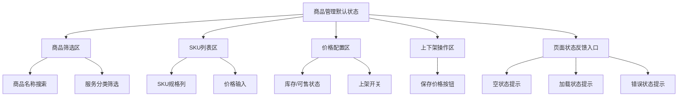

# 商品管理 Page Layout

## 0.文档状态

<table>
  <tr><td>文档类型</td><td>Development</td></tr>
  <tr><td>文档版本</td><td>V1</td></tr>
  <tr><td>生成日期</td><td>2026-05-19</td></tr>
  <tr><td>来源Sitemap</td><td>product/layout/管理后台-PC-Web-sitemap.md</td></tr>
  <tr><td>使用Layout</td><td>管理后台 / PC Web</td></tr>
  <tr><td>页面清单ID</td><td>PAGE-026</td></tr>
  <tr><td>状态组</td><td></td></tr>
</table>

## 1.页面布局说明

### 1.1.页面目标与范围

`商品管理` 面向 管理员，服务于「服务配置」场景。页面依据 PEF-018 生成，覆盖：PEF-018 商品SKU与定价发布（全局配置）。当前页为独立页面，默认状态覆盖用户首次进入时的主要可见内容。

当前文档只描述页面本体内容；顶栏、侧栏、底栏、全局搜索、用户菜单等全局壳元素只通过 `来源Sitemap` 与 `使用Layout` 引用，不在本页面元素表中重复展开。

### 1.2.使用的layout与状态

| 引用项 | 值 | 说明 |
|---|---|---|
| 来源Sitemap | product/layout/管理后台-PC-Web-sitemap.md | 后续 skill 需要合并全局壳时，应回读该 sitemap。 |
| 使用Layout | 管理后台 / PC Web | 仅作为 layout 引用，不在当前页面文档中展开顶栏、侧栏、底栏、导航等全局元素。 |
| 页面挂载上下文 | PAGE-023-服务发布管理 / PAGE-026-商品管理 | 当前页面在 sitemap 页面清单中的完整父子链路。 |
| 全局Layout读取位置 | 来源Sitemap `1.layout布局方式` 与 `1.2.区域、分组与元素` | 当前文档专注页面本体，后续合并分析时再读取全局 layout。 |

### 1.3.完整页面内容

#### 1.3.1.默认状态页面结构

1. **商品筛选区**：包含商品名称搜索、服务分类筛选。
2. **SKU列表区**：包含SKU规格列、价格输入。
3. **价格配置区**：包含库存/可售状态、上架开关。
4. **上下架操作区**：包含保存价格按钮。

默认状态下，页面优先呈现用户完成「服务配置」所需的主要信息与操作。若页面包含列表或配置项，默认展示有数据样例，并保留空、加载、错误状态作为差异状态。

#### 1.3.2.默认状态元素细节

- 商品名称搜索：支持录入关键词或业务值；提交前进行必填、格式或长度校验。
- 服务分类筛选：切换后刷新当前内容区，并保留当前页面上下文。
- SKU规格列：展示 服务配置 场景下的关键业务信息。
- 价格输入：支持录入关键词或业务值；提交前进行必填、格式或长度校验。
- 库存/可售状态：展示 服务配置 场景下的关键业务信息。
- 上架开关：展示 服务配置 场景下的关键业务信息。
- 保存价格按钮：点击后触发当前页主要业务动作，并在加载、成功、失败状态下反馈结果。

#### 1.3.3.状态清单

| 状态ID | 状态名称 | 状态类型 | 触发条件 | 影响区域/元素 | 是否默认状态 | 布局处理方式 |
|---|---|---|---|---|---|---|
| STATE-VIEW-001 | 默认状态 | 页面视图状态 | 首次进入页面或返回该页面 | 全页面默认结构 | 是 | 完整页面基线 |
| STATE-VIEW-002 | 空状态 | 页面视图状态 | 无匹配业务数据或当前状态暂无记录 | 价格配置区 | 否 | 复用默认布局，替换为明确空状态文案和返回/重置入口 |
| STATE-VIEW-003 | 加载状态 | 页面视图状态 | 页面初始化、刷新或提交后等待接口返回 | 价格配置区 | 否 | 复用默认布局，显示骨架屏或加载提示 |
| STATE-VIEW-004 | 错误状态 | 页面视图状态 | 数据请求失败、提交失败或权限校验失败 | 价格配置区 | 否 | 复用默认布局，展示错误原因、重试或返回入口 |

#### 1.3.4.状态差异说明

- 空状态：保留标题、筛选或摘要区域，将主内容替换为「暂无符合条件的数据」与返回、重置或新建入口。
- 加载状态：保留页面结构，主内容区显示骨架屏或加载提示；提交类按钮进入禁用或处理中态。
- 错误状态：在受影响区域展示错误原因、重试按钮和返回入口；不改变页面默认信息架构。

### 1.4.默认状态页面结构图

### 1.5.页面元素清单

| ID | 元素来源 | 区域 | Group ID | 分组 | Element ID | 元素 | 类型 | 状态/数据分类 | 是否状态差异元素 | 状态差异说明 | 数据来源 | 交互/校验规则 | 备注/关联待确认ID |
|---|---|---|---|---|---|---|---|---|---|---|---|---|---|
| PLE-001 | Page Content | 内容区 | PGR-001 | 商品筛选区 | PEL-001 | 商品名称搜索 | 文本/展示 | 默认状态 | 否 | 无 | PEF-018 | 支持录入关键词或业务值；提交前进行必填、格式或长度校验。 | PEF-018 商品SKU与定价发布（全局配置） |
| PLE-002 | Page Content | 内容区 | PGR-001 | 商品筛选区 | PEL-002 | 服务分类筛选 | 选择控件 | 默认状态 | 否 | 无 | PEF-018 | 切换后刷新当前内容区，并保留当前页面上下文。 | PEF-018 商品SKU与定价发布（全局配置） |
| PLE-003 | Page Content | 内容区 | PGR-002 | SKU列表区 | PEL-003 | SKU规格列 | 文本/展示 | 默认状态 | 否 | 无 | PEF-018 | 展示 服务配置 场景下的关键业务信息。 | PEF-018 商品SKU与定价发布（全局配置） |
| PLE-004 | Page Content | 内容区 | PGR-002 | SKU列表区 | PEL-004 | 价格输入 | 输入框 | 默认状态 | 否 | 无 | PEF-018 | 支持录入关键词或业务值；提交前进行必填、格式或长度校验。 | PEF-018 商品SKU与定价发布（全局配置） |
| PLE-005 | Page Content | 内容区 | PGR-003 | 价格配置区 | PEL-005 | 库存/可售状态 | 文本/展示 | 默认状态 | 否 | 无 | PEF-018 | 展示 服务配置 场景下的关键业务信息。 | PEF-018 商品SKU与定价发布（全局配置） |
| PLE-006 | Page Content | 内容区 | PGR-003 | 价格配置区 | PEL-006 | 上架开关 | 文本/展示 | 默认状态 | 否 | 无 | PEF-018 | 展示 服务配置 场景下的关键业务信息。 | PEF-018 商品SKU与定价发布（全局配置） |
| PLE-007 | Page Content | 内容区 | PGR-004 | 上下架操作区 | PEL-007 | 保存价格按钮 | 按钮 | 默认状态 | 否 | 无 | PEF-018 | 点击后触发当前页主要业务动作，并在加载、成功、失败状态下反馈结果。 | PEF-018 商品SKU与定价发布（全局配置） |
| PLE-008 | Derived State | 内容区 | PGR-900 | 页面状态反馈区 | PEL-008 | 空状态容器 | 状态展示 | 空状态 | 是 | 默认主内容替换为空状态提示。 | 页面状态 | 展示无数据原因，并提供返回、重置或新建入口。 |  |
| PLE-009 | Derived State | 内容区 | PGR-900 | 页面状态反馈区 | PEL-009 | 加载状态提示 | 状态展示 | 加载状态 | 是 | 默认主内容显示加载提示或骨架屏。 | 页面状态 | 数据请求中展示，禁用重复提交。 |  |
| PLE-010 | Derived State | 内容区 | PGR-900 | 页面状态反馈区 | PEL-010 | 错误状态提示 | 状态展示 | 错误状态 | 是 | 默认主内容显示错误原因和重试入口。 | 页面状态 | 数据请求或提交失败时展示。 |  |

## 2.Mock数据

### 2.1.数据分类说明

默认状态数据集覆盖 `商品管理` 的主要可见内容、示例业务对象、状态标签、按钮文案与表单选项。状态差异数据集只记录空、加载、错误以及当前状态组页面的差异文案或替换内容。

### 2.2.Mock数据表

| Mock ID | 关联元素ID | 数据分类 | 字段 | 示例值 | 数据类型 | 适用状态组/页面类型 | 备注 |
|---|---|---|---|---|---|---|---|
| MOCK-001 | PLE-001 | 默认状态数据集 | 商品 | 商品 商标注册基础套餐 | string | 页面 | 默认状态示例数据 |
| MOCK-002 | PLE-002 | 默认状态数据集 | SKU | SKU 中国大陆/1类 | string | 页面 | 默认状态示例数据 |
| MOCK-003 | PLE-003 | 默认状态数据集 | 价格 | 价格 ¥3,999.00 | string | 页面 | 默认状态示例数据 |
| MOCK-004 | PLE-004 | 默认状态数据集 | 状态 | 状态 上架 | string | 页面 | 默认状态示例数据 |
| MOCK-005 | PLE-008 | 状态差异数据集 | 空状态文案 | 暂无符合条件的数据 | string | 页面 | 空状态替换主内容。 |
| MOCK-006 | PLE-009 | 状态差异数据集 | 加载文案 | 加载中，请稍候 | string | 页面 | 加载状态覆盖主内容。 |
| MOCK-007 | PLE-010 | 状态差异数据集 | 错误文案 | 数据加载失败，请重试 | string | 页面 | 错误状态显示重试入口。 |

## 3.待确认与假设

- A-001【假设】
  - 内容：当前文档根据 sitemap 页面清单、Product Overview 与同状态组语义生成；具体字段枚举、接口返回值、权限边界以后续接口/业务规则为准。
  - 影响范围：页面元素清单、Mock 数据、状态差异说明。
  - 用户回复：

## 4.用户补充说明

用户可在此补充新的页面布局想法、确认项修改或元素范围调整：
