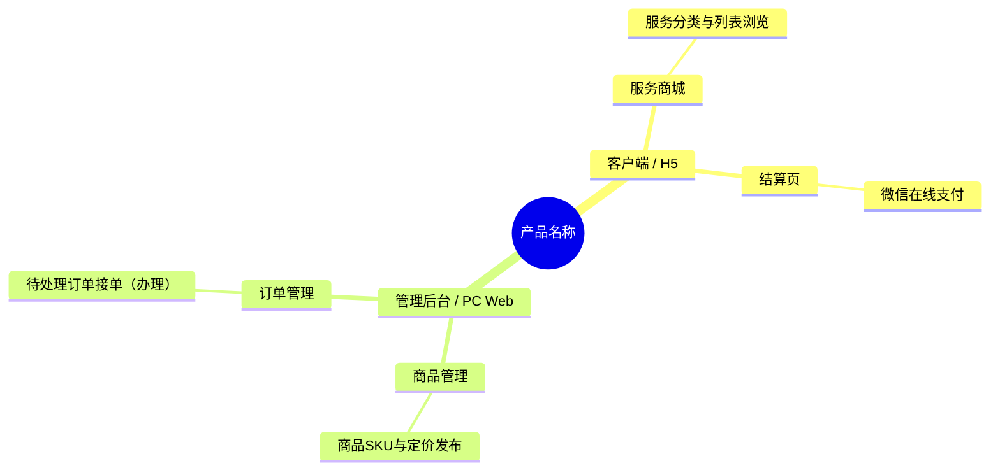

# PM 01 Analysis

## Goal

Create or update `product/Product Overview.md` from all relevant materials in `docs/` plus the user's current request. Write the document in Chinese and keep it suitable for downstream product-planning skills, especially sitemap generation.

This skill must be usable by any capable AI assistant. Do not rely on vendor-specific concepts, tool names, or platform assumptions in the generated document or in the execution logic.

## Cross-Model Compatibility

Support OpenAI/Codex, Gemini, Claude, and other capable AI assistants through the same instructions and output schema.

- Treat `SKILL.md` as the canonical process definition for every assistant.
- Treat `assets/product-overview-template.md` as the canonical generation template for every assistant.
- Keep `agents/openai.yaml` only as OpenAI/Codex UI metadata; it is not the source of truth.
- Use `agents/gemini.md` and `agents/claude.md` as lightweight adapter prompts when running this skill in Gemini or Claude environments.
- If an environment does not support skill metadata, paste the relevant adapter prompt plus this `SKILL.md` into that assistant and require the same output path and template.
- Never create model-specific variants of `Product Overview.md`; all assistants must produce the same Markdown schema.

## Canonical Template

Before generating or updating the product overview, open `assets/product-overview-template.md` and use it as the fixed output skeleton.

Rules:

- Preserve every heading, heading level, table column, and placeholder label from the template.
- Fill placeholders with synthesized product content.
- For Release output, start from the same template and remove only sections `3.待确认与假设` and `4.用户补充说明`.
- If this `SKILL.md` and the template appear to conflict during generation, use the template for exact Markdown structure and this file for lifecycle/merge logic. Do not improvise a third format.

## Source Inputs

Use the current workspace as the project root unless the user specifies another root.

Read and synthesize:

- User's current prompt and any explicit product notes.
- Existing `product/Product Overview.md`, if present.
- Files under `docs/`, including `.md`, `.markdown`, `.txt`, `.doc`, `.docx`, `.pdf`, and image files such as `.png`, `.jpg`, `.jpeg`, `.webp`, `.heic`, `.svg`.

For each source, extract product facts, user roles, pages, workflows, business rules, permissions, commercial/operations capabilities, and unresolved ambiguity. Use OCR or available image/PDF extraction tools for visual files when possible. If a source cannot be read, list it in `3.待确认与假设` as an input limitation.

## Document Lifecycle

Before writing, check whether `product/Product Overview.md` already exists.

### New Document

If the file does not exist:

- Create `product/` if needed.
- Generate a Development document by default.
- In `0.文档状态`, write the fixed headerless two-column HTML status table with `文档类型` = `Development`, `文档版本` = `V1`, and `生成日期` = current local date in `YYYY-MM-DD` format.
- Include sections `3.待确认与假设` and `4.用户补充说明`.

### Existing Development Document

If the file exists and the user did not explicitly request a Release/formal document:

- Parse the full existing document, including the current document status table, sections `1` and `2`, section `3.待确认与假设`, and section `4.用户补充说明`.
- Treat existing content as user-approved review input, regardless of section, as long as the required document structure is still recoverable.
- Apply confirmed decisions, corrections, and supplementary requirements into sections `1` and `2`.
- Re-read `docs/` and the user's current prompt, then update the whole document for consistency.
- Increment the version one step by parsing the numeric suffix: `V1` to `V2`, `V2` to `V3`, `V3` to `V4`, and so on without an upper limit. If the existing version is malformed or missing, set the next version to `V1` for a new document or `V2` for an existing document and add an `R-xxx【风险/资料缺口】` item noting the repaired version source.
- Keep `文档类型` as `Development`.
- Refresh `生成日期`.
- Rewrite section `3` with only remaining or newly discovered open questions and assumptions.
- Clear incorporated notes from section `4` and leave a short placeholder for new user notes.

Consider section `3` or `4` empty if it contains only placeholders such as `暂无`, `无`, blank bullets, or instructions for future input.

### Release Document

If the user explicitly requests a formal, release, or production-ready document:

- Set status-table `文档类型` to `Release`.
- If creating from scratch, set version to `V1`; if updating an existing document, increment the `Vn` numeric suffix by one using the same unlimited version rule.
- Refresh status-table `生成日期`.
- Incorporate any confirmed decisions from existing sections `3` and `4` wherever possible.
- Remove sections `3.待确认与假设` and `4.用户补充说明` completely.
- Do not leave unresolved-question language in the Release document. If critical uncertainty remains, make a conservative explicit assumption in the relevant content section and phrase it as a product decision, not as a question.

## User Editing Rule

Users may modify any document content, including sections `1`, `2`, `3`, and `4`.

The only protected part is the document structure:

- Do not change required heading names, numbering, or nesting.
- Do not change required table column names.
- Do not remove required sections in Development documents.
- Do not change ID formats.

When updating an existing Development document, treat direct edits in sections `1` and `2` as already-approved product content unless they conflict with newer user instructions or source documents. Continue to use sections `3` and `4` as optional structured review channels, not as the only valid editing locations.

## Format Stability and Loss Prevention

Generate the Markdown with a deterministic schema. Different AI assistants and repeated invocations must produce the same section order, heading text, table columns, and placeholder labels.

Rules:

- Never rename, renumber, merge, or omit required headings.
- Never convert the required product-end table into prose, bullet lists, HTML tables, or alternate column names. The document-status table is the only required HTML table and must stay HTML.
- Never remove existing product facts unless they are contradicted by a newer source or by an explicit user reply.
- Never overwrite direct user edits in any content section unless a newer user instruction explicitly supersedes them.
- When updating, first extract all existing facts from sections `1` and `2`, then merge new source facts into them. Prefer additive refinement over replacement.
- Preserve facts whose source is unclear by keeping them and adding an `R-xxx【风险/资料缺口】` item asking for confirmation.
- Preserve unresolved items from section `3` unless the user has answered them in `用户回复`.
- When a user reply confirms or modifies an item, apply it to sections `1` and `2`, then remove that item from section `3` unless follow-up uncertainty remains.
- If an existing document has a malformed section, repair it into the required schema while preserving all recoverable content under the most relevant required section.
- Do not leave empty required sections. Use `暂无明确资料。` only when no source or reasonable assumption supports content.

## Output Structure

Use exactly these top-level sections for Development documents:

```markdown
# Product Overview

## 0.文档状态

<table>
  <tr><td>文档类型</td><td>Development</td></tr>
  <tr><td>文档版本</td><td>V1</td></tr>
  <tr><td>生成日期</td><td>YYYY-MM-DD</td></tr>
</table>

## 1.产品综合介绍
### 1.1.产品定位
### 1.2.核心业务目标
### 1.3.核心用户路径
### 1.4.页面范围
### 1.5.功能范围
### 1.6.角色与权限
### 1.7.关键操作
### 1.8.商业化与运营能力

## 2.产品设计概览
### 2.1.产品端与形态综述
### 2.2.产品端与形态思维导图
### 2.3.产品端与形态表

## 3.待确认与假设

## 4.用户补充说明
```

For Release documents, use the same structure but omit sections `3` and `4`.

### Required Status Table

`0.文档状态` must always be a headerless two-column HTML table, never subheadings, bullet lists, or a Markdown pipe table. Do not include a table header and do not include a `说明` column. Use exactly these rows:

```markdown
<table>
  <tr><td>文档类型</td><td>Development</td></tr>
  <tr><td>文档版本</td><td>V1</td></tr>
  <tr><td>生成日期</td><td>2026-05-14</td></tr>
</table>
```

Replace the example values with the correct lifecycle values. Keep row labels exactly as `文档类型`, `文档版本`, and `生成日期`. For updates, increment `文档版本` by one from the existing numeric suffix with no maximum version cap.

## Section Guidance

### 1.产品综合介绍

Summarize the product as a coherent product brief, not as a file-by-file summary.

- `1.1.产品定位`: State target market, target users, product category, and core value.
- `1.2.核心业务目标`: List measurable or directional goals such as acquisition, conversion, retention, operational efficiency, data collection, sales, delivery, or compliance.
- `1.3.核心用户路径`: Describe major end-to-end user journeys by role.
- `1.4.页面范围`: List pages, screens, modules, or system areas in scope.
- `1.5.功能范围`: List major feature groups and boundaries.
- `1.6.角色与权限`: Define roles and their access/control differences.
- `1.7.关键操作`: Identify important user and admin actions.
- `1.8.商业化与运营能力`: Cover pricing, orders, membership, campaigns, content operations, analytics, notifications, customer service, approvals, or other monetization/operations needs when relevant.

### 2.产品设计概览

#### 2.1.产品端与形态综述

Identify all likely product ends and runtime forms. Include explicit possibilities only when supported by sources or needed as reasonable assumptions. Common ends/forms include:

- 客户端: PC Web, H5, iOS App, Android App, 小程序, 桌面 App.
- 管理后台: PC Web admin console, internal operations console, CRM/CMS/OMS-style backend.
- 商家端/供应商端/服务端: merchant console, provider portal, delivery/fulfillment app.
- 员工端/现场端: mobile workbench, inspection app, tablet app.
- API/开放平台: developer portal, API keys, webhook/event management.

For each end/form, explain:

- Target user role.
- Primary scenarios.
- Main functional modules.
- Permission or data boundary.
- Relationship with other ends.

#### 2.2.产品端与形态思维导图

Provide a human-readable mind map that corresponds exactly to section `2.3.产品端与形态表`.

The mind map must follow this hierarchy:

`root((产品名称))` -> `[产品端 + 形态描述]` -> `[页面/模块]` -> `[功能点]`

Rules:

- Use section `2.3.产品端与形态表` as the source of truth.
- Every unique `页面/模块` in the table must appear under the matching `[产品端 + 形态描述]` node in the mind map.
- Every unique `功能点` in the table must appear under the matching `[页面/模块]` node in the mind map.
- Every page/module and function point shown in the mind map must have at least one corresponding row in the table.
- The `[产品端 + 形态描述]` node must combine table columns `端` and `形态`, for example `客户端 / H5` or `管理后台 / PC Web`.
- The `[页面/模块]` node must use the exact value from the table column `页面/模块`; do not replace it with broad categories such as `服务浏览与下单`, `案件办理与交付`, or `数据分析与统计` unless those are the exact page/module names in the table.
- If the same `页面/模块` appears in multiple product ends/forms, repeat it under each matching `[产品端 + 形态描述]` node.
- If the same `功能点` appears in multiple pages/modules, repeat it under each matching `[页面/模块]` node.
- Do not place `核心场景` or `用户角色` as independent mind-map levels. Those details belong in the table.
- Keep the mind map and table synchronized whenever either section is updated.

Prefer Mermaid `mindmap` syntax:



If Mermaid is not suitable, use an indented Markdown tree.

#### 2.3.产品端与形态表

Provide a stable Markdown table for downstream automation. Do not merge cells. Use these exact columns:

| ID | 端 | 形态 | 用户角色 | 核心场景 | 功能点 | 页面/模块 | 权限/数据边界 | 来源/依据 | 备注/关联待确认ID |
|---|---|---|---|---|---|---|---|---|---|

Use one row per atomic product-end/form/role/scenario/feature combination.

- `ID` must be unique and stable, using `PEF-001`, `PEF-002`, `PEF-003` format.
- Do not combine multiple `核心场景` values in one row.
- Do not combine multiple `功能点` values in one row.
- Do not combine multiple `页面/模块` values in one row.
- Do not use semicolon-separated lists or slash-joined lists in `核心场景`, `功能点`, or `页面/模块`.
- If one role has three scenarios and each scenario has two feature points across two pages/modules, create separate rows for every page/module and feature-point pairing.
- When updating, preserve existing row IDs for unchanged rows. Add new rows with the next available ID. Retire obsolete rows only when contradicted by user input or source evidence; if removal is uncertain, keep the row and reference an `R-xxx` item.

## Assumptions and Confirmation IDs

In Development documents, section `3.待确认与假设` must be a Markdown list with numbered IDs for every open point and a user reply position for each item.

Use this format:

```markdown
- A-001【假设】
  - 内容：...
  - 影响范围：...
  - 用户回复：
- C-001【待确认】
  - 内容：...
  - 影响范围：...
  - 用户回复：
- R-001【风险/资料缺口】
  - 内容：...
  - 影响范围：...
  - 用户回复：
```

Use:

- `A-xxx` for reasonable assumptions made because sources are incomplete.
- `C-xxx` for decisions the user should confirm or correct.
- `R-xxx` for source limitations, conflicts, or risks that affect product definition.

Each item must be actionable and specific. Avoid vague items such as "需要进一步确认需求".

Keep the nested labels exactly as `内容：`, `影响范围：`, and `用户回复：`.

- `内容：` states the assumption, question, or risk.
- `影响范围：` names affected sections, pages, roles, product ends, or downstream sitemap impact.
- `用户回复：` must be left blank for the user to fill in unless carrying forward an existing unprocessed reply.

If no open items remain in a Development document, still keep section `3` and write exactly:

```markdown
- C-000【待确认】
  - 内容：暂无待确认项。
  - 影响范围：无。
  - 用户回复：
```

## User Supplement Section

In Development documents, section `4.用户补充说明` is the user's scratch area for the next review cycle. After incorporating prior notes, leave:

```markdown
用户可在此补充新的产品想法、确认项修改或范围调整：

```

## Quality Checklist

Before finishing:

- Ensure the output file path is exactly `product/Product Overview.md`.
- Ensure the document is in Chinese.
- Ensure Development documents include sections `3` and `4`; Release documents do not.
- Ensure the version and date are updated according to the lifecycle rules.
- Ensure `0.文档状态` is exactly the required table schema.
- Ensure section `2.3` uses the exact table columns required above, includes stable `PEF-xxx` IDs, and has one row per single `核心场景` plus single `功能点`.
- Ensure section `2.2` is synchronized with section `2.3`: its second level is `[端 / 形态]`, its third level is `页面/模块`, its fourth level is `功能点`, and every page/module/function point corresponds to at least one table row.
- Ensure section `3` is a list, every item has a stable ID, and every item includes a `用户回复：` line; leave it blank for new unresolved items and preserve it when carrying forward an existing unprocessed user reply.
- Ensure no section is only a raw dump of source text.
- Ensure updating the document did not drop any existing product fact, direct user edit, role, page, end/form, feature, row ID, or user-provided note without incorporating it or preserving it as an open item.
- Ensure product ends/forms are explicit enough for a later sitemap-generation skill to consume.
