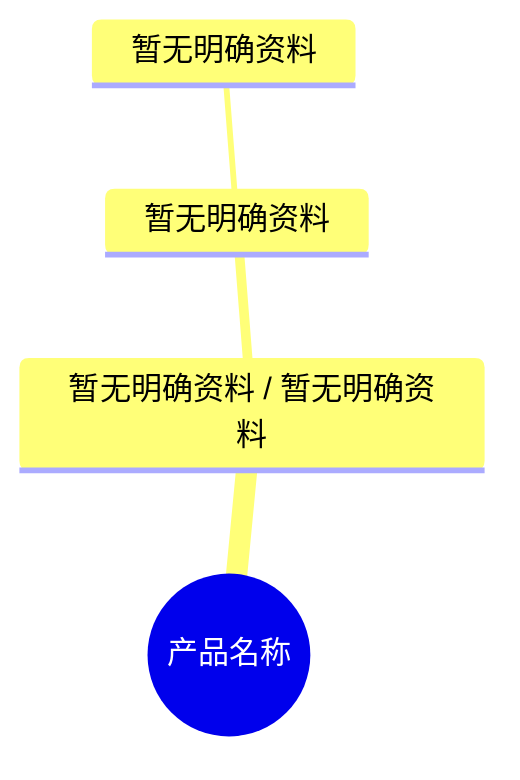

# Product Overview

## 0.文档状态

<table>
  <tr><td>文档类型</td><td>Development</td></tr>
  <tr><td>文档版本</td><td>V1</td></tr>
  <tr><td>生成日期</td><td>YYYY-MM-DD</td></tr>
</table>

## 1.产品综合介绍

### 1.1.产品定位

暂无明确资料。

### 1.2.核心业务目标

暂无明确资料。

### 1.3.核心用户路径

暂无明确资料。

### 1.4.页面范围

暂无明确资料。

### 1.5.功能范围

暂无明确资料。

### 1.6.角色与权限

暂无明确资料。

### 1.7.关键操作

暂无明确资料。

### 1.8.商业化与运营能力

暂无明确资料。

## 2.产品设计概览

### 2.1.产品端与形态综述

暂无明确资料。

### 2.2.产品端与形态思维导图

### 2.3.产品端与形态表

| ID | 端 | 形态 | 用户角色 | 核心场景 | 功能点 | 页面/模块 | 权限/数据边界 | 来源/依据 | 备注/关联待确认ID |
|---|---|---|---|---|---|---|---|---|---|
| PEF-001 | 暂无明确资料 | 暂无明确资料 | 暂无明确资料 | 暂无明确资料 | 暂无明确资料 | 暂无明确资料 | 暂无明确资料 | 暂无明确资料 |  |

## 3.待确认与假设

- C-000【待确认】
  - 内容：暂无待确认项。
  - 影响范围：无。
  - 用户回复：

## 4.用户补充说明

用户可在此补充新的产品想法、确认项修改或范围调整：
