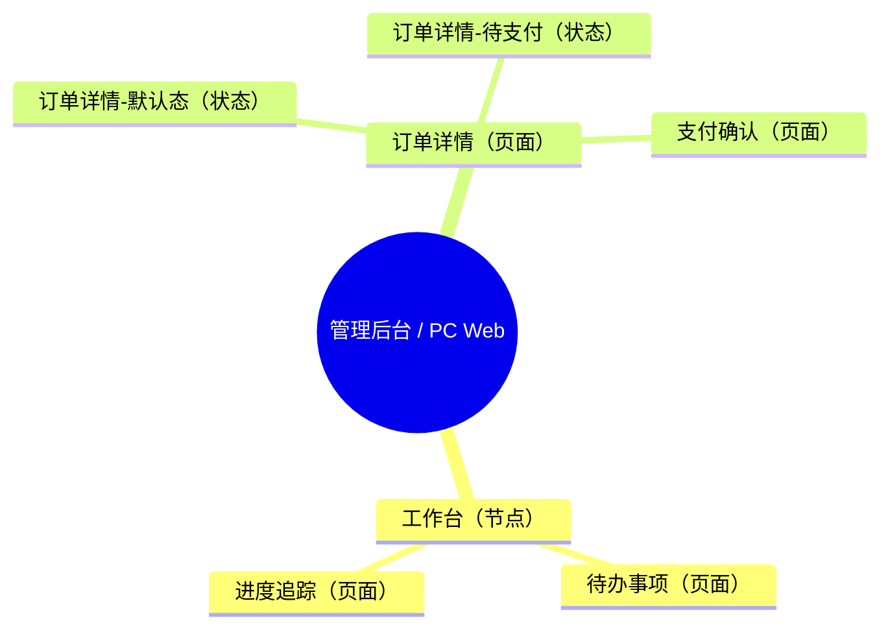

# PM 02 Sitemap

## Goal

Create or update one sitemap document per application end/form under `product/layout/`, using `product/Product Overview.md` as the source of truth.

Output path pattern:

```text
product/layout/<应用端>-sitemap.md
```

The document must be written in Chinese and must be stable enough for downstream UI, wireframe, and design-generation skills to parse.

## Cross-Model Compatibility

Support OpenAI/Codex, Gemini, Claude, and other capable AI assistants through the same workflow and output schema.

- Treat `SKILL.md` as the canonical process definition.
- Treat `assets/sitemap-template.md` as the canonical generation template.
- Keep `agents/openai.yaml` only as OpenAI/Codex UI metadata; it is not the source of truth.
- Use `agents/gemini.md` and `agents/claude.md` as lightweight adapter prompts in Gemini or Claude environments.
- If an environment does not support skill metadata, paste the relevant adapter prompt plus this `SKILL.md` into that assistant and require the same output path and template.
- Never create model-specific variants of sitemap documents.

## Canonical Template

Before generating or updating any sitemap document, open `assets/sitemap-template.md` and use it as the fixed output skeleton.

Rules:

- Preserve every heading, heading level, table column, list label, ID format, and placeholder label from the template.
- Fill placeholders with content synthesized from `product/Product Overview.md`, `docs/`, and the user's current request.
- For Release output, start from the same template and remove only sections `3.待确认与假设` and `4.用户补充说明`.
- If this file and the template appear to conflict during generation, use the template for exact Markdown structure and this file for lifecycle/merge logic.

## Source Inputs

Use the current workspace as the project root unless the user specifies another root.

Read and synthesize:

- `product/Product Overview.md`, especially `2.产品设计概览`.
- Section `2.3.产品端与形态表` rows and stable `PEF-xxx` IDs.
- Section `2.2.产品端与形态思维导图` as a human-readable cross-check.
- Existing `product/layout/<应用端>-sitemap.md`, if present.
- Files under `docs/` only as supporting context when the product overview is ambiguous.
- User's current prompt and explicit target application end, if provided.

If `product/Product Overview.md` is missing, stop and ask the user to run `pm-01-analysis` first. Do not invent a sitemap from `docs/` alone.

## Decide Which Sitemap Files To Generate

Use `product/Product Overview.md` section `2.3.产品端与形态表` as the source of truth.

1. Group rows by unique `端 + 形态`.
2. For each group, create one sitemap document unless the user explicitly asks to generate only a specific application end/form.
3. Use the display label `<端> / <形态>` inside the document's `产品端与形态` row.
4. Use a filesystem-safe `<应用端>` filename derived from the same label:
   - Replace `/`, `\`, `:`, `*`, `?`, `"`, `<`, `>`, `|` with `-`.
   - Replace whitespace runs with `-`.
   - Keep Chinese characters.
   - Example: `客户端 / PC Web` -> `客户端-PC-Web-sitemap.md`.
5. Preserve existing filenames if updating a matching existing sitemap for the same `产品端与形态`.

## Document Lifecycle

Before writing, compute the target path once and use it for every lifecycle mode:

```text
product/layout/<应用端>-sitemap.md
```

Release and Development documents are different document states of the same sitemap file. Never create `release/layout/`, `product/release/`, `product/layout/release/`, or any separate Release copy. A Release request updates the existing Development sitemap in place at the same target path, incrementing its version and removing Development-only sections.

Before writing, check whether the target `product/layout/<应用端>-sitemap.md` exists.

### New Document

If the file does not exist:

- Create `product/layout/` if needed.
- Generate a Development document by default.
- In `0.文档状态`, write the fixed headerless two-column HTML status table with:
  - `文档类型` = `Development`
  - `文档版本` = `V1`
  - `生成日期` = current local date in `YYYY-MM-DD` format
  - `产品端与形态` = `<端> / <形态>`
- Include sections `3.待确认与假设` and `4.用户补充说明`.

### Existing Development Document

If the file exists and the user did not explicitly request a Release/formal document:

- Parse the full existing sitemap, including status table, layout section, sitemap section, section `3.待确认与假设`, and section `4.用户补充说明`.
- Before updating section `1.2.区域、分组与元素` or section `2.sitemap站点/APP地图`, run the Mind Map/Table Consistency Gate below.
- Treat non-empty content in `3.待确认与假设` and `4.用户补充说明` as the user's structured review input for this run.
- Apply confirmed decisions, corrections, and supplementary requirements into sections `1` and `2`.
- Re-read `product/Product Overview.md` and the user's current prompt, then update the whole sitemap for consistency.
- Increment the version one step by parsing the numeric suffix: `V1` to `V2`, `V2` to `V3`, `V3` to `V4`, and so on without an upper limit. If the existing version is malformed or missing, set the next version to `V2` and add an `R-xxx【风险/资料缺口】` item noting the repaired version source.
- Keep `文档类型` as `Development`.
- Refresh `生成日期`.
- Rewrite section `3` with only remaining or newly discovered open questions and assumptions.
- Clear incorporated notes from section `4` and leave the standard placeholder.

Consider section `3` or `4` empty if it contains only placeholders such as `暂无`, `无`, blank bullets, or instructions for future input.

### Release Document

If the user explicitly requests a formal, release, production-ready, 正式版, 正式文档, 发布版, or release版 sitemap, this Release path overrides the Development path even when an existing Development document has non-empty sections `3` or `4`.

- Use the same target file path `product/layout/<应用端>-sitemap.md`.
- If an existing Development sitemap file is present at that path, update that file in place. Do not create a second file.
- If a stale Release copy exists somewhere else, such as `release/layout/<应用端>-sitemap.md`, do not treat it as the target source of truth. Prefer the canonical `product/layout/<应用端>-sitemap.md` file and add an `R-xxx【风险/资料缺口】` item only if conflicting content must be reviewed before Release.
- Before converting to Release, run the Mind Map/Table Consistency Gate below. If a mismatch exists and the user has not specified priority, stop and ask for priority before producing Release.
- Set status-table `文档类型` to `Release`.
- If creating from scratch, set version to `V1`; if updating an existing document, increment the `Vn` numeric suffix by one.
- Refresh `生成日期`.
- Incorporate confirmed decisions from existing sections `3` and `4` wherever possible.
- Remove sections `3.待确认与假设` and `4.用户补充说明` completely, including their headings and all content under them.
- Do not leave unresolved-question language in the Release document. If critical uncertainty remains, make a conservative explicit decision in the relevant section.

Mandatory Release post-processing:

- After composing the document, scan the entire output.
- If `## 3.待确认与假设` exists, delete it and everything after it through the end of section `4` if present.
- If `## 4.用户补充说明` exists, delete it and everything under it.
- Verify the status table contains `<tr><td>文档类型</td><td>Release</td></tr>`.
- Verify the output path is still `product/layout/<应用端>-sitemap.md` and not any `release/` directory.
- Do not output placeholder confirmation items such as `C-000` in Release documents.

## Mind Map/Table Consistency Gate

Users may edit either the mind map or the corresponding table directly. On every update of an existing sitemap, and before every Release conversion, compare each mind map with its corresponding data table before changing layout or sitemap content.

This gate is blocking. If any mismatch exists, the assistant must not rewrite, save, or output an updated sitemap document in the same response. It must ask the user for priority first and wait for the user's answer.

For all model runtimes, including Codex/GPT, Google Gemini, and Claude, follow this mandatory blocking protocol before any update:

1. Extract layout mind-map records with `区域`, `分组`, `元素`, `类型`, and `parent path`.
2. Extract layout-table records with `区域ID`, `区域`, `Group ID`, `分组`, `Element ID`, `元素`, and `类型`.
3. Extract sitemap mind-map records with `name`, `type`, and `parent path`.
4. Extract page-list records with `页面/模块`, `页面类型`, and parent path derived from `父级ID`.
5. Compare layout records by `区域 + 分组 + 元素 + 类型`.
6. Compare sitemap records by `name + parent path + type`.
7. If any item differs in either pair, stop immediately and ask the priority question. Do not continue generating the sitemap.

Codex/GPT, Gemini, and Claude must all treat this protocol as a hard stop. A mismatch response must not include a rewritten sitemap, a partial patch, updated Markdown sections, or a statement that the file has been updated.

Pairs to compare:

1. Section `1.2.区域、分组与元素`:
   - Mind map: layout Mermaid mind map.
   - Data table: `区域ID | 区域 | Group ID | 分组 | Element ID | 元素 | 类型 | 说明`.
2. Section `2.sitemap站点/APP地图`:
   - Mind map: `2.1.sitemap思维导图`.
   - Data table: `2.2.页面清单`.

Comparison rules:

- Normalize whitespace and Mermaid indentation before comparison.
- For layout, compare the hierarchy `区域 -> 分组 -> 元素（类型）` against every table row's `区域`, `分组`, `元素`, and `类型`.
- Extract layout mind-map records from `1.2.区域、分组与元素` by reading `root((布局))` children as:
  - first level = `区域`
  - second level = `分组`
  - third level = `元素（类型）`
- Layout element labels must include an explicit full-width type suffix in the form `元素名称（类型）`. ASCII parentheses may be normalized during comparison, but regenerated documents must use full-width parentheses.
- If any layout element label lacks a type suffix, treat its type as `类型未知` and flag it as a mismatch instead of inferring the type from the table.
- Build a comparable layout item record for both sides:
  - `区域`
  - `分组`
  - `元素`
  - `类型`
  - stable IDs when available: `区域ID`, `Group ID`, `Element ID`
- A layout item is consistent only when the matched mind-map item and layout-table row have the same normalized `区域`, `分组`, `元素`, and `类型`.
- For sitemap, compare every mind-map item with page-list rows by identity, hierarchy, and type. Type comparison is mandatory and must distinguish exactly: `节点`, `页面`, `状态`.
- Extract sitemap mind-map item type from the item label's explicit type suffix. Accepted suffixes are exactly `（节点）`, `（页面）`, `（状态）`; ASCII parentheses such as `(节点)` may be normalized to the same value during comparison, but the regenerated document must use full-width suffixes.
- If a mind-map item contains a leading ID such as `PAGE-001 登录页（页面）`, use that ID as the primary match key. If no ID is present, match by normalized parent path plus normalized `页面/模块` name after removing the type suffix.
- If the mind map omits the type suffix for any sitemap item, treat that item as `类型未知` and flag it as a mismatch instead of inferring its type from hierarchy.
- Build a comparable sitemap item record for both sides:
  - `ID` when available.
  - `父级路径` / parent hierarchy.
  - `页面/模块` normalized name.
  - `页面类型` normalized to one of `节点`, `页面`, `状态`.
  - `状态组` when `页面类型 = 状态`.
- A sitemap item is consistent only when the matched mind-map item and page-list row have the same normalized name, same parent hierarchy, and same `页面类型`.
- Treat missing rows, extra rows, changed names, changed hierarchy, changed page/layout type, changed state/modal placement, changed parent-child relationship, and same-name/different-type cases as mismatches.
- Examples of layout mismatches that must stop the update:
  - Mind map shows `用户菜单（头像菜单）`, but the layout table row `用户菜单` has `类型 = 下拉菜单`.
  - Mind map contains `顶栏 -> 全局操作 -> 通知入口（按钮）`, but the table has no matching `区域=顶栏 / 分组=全局操作 / 元素=通知入口` row.
- Examples of type mismatches that must stop the update:
  - Mind map shows `工作台（页面）`, but the page list row `工作台` has `页面类型 = 节点`.
  - Mind map shows `订单详情-待支付（状态）`, but the page list row has `页面类型 = 页面`.
- Do not resolve type mismatches automatically by applying the table's type to the mind map or by applying the mind map's type to the table.
- Ignore purely visual Mermaid formatting differences that do not change hierarchy or labels.

If both the mind map and the table are consistent:

- Continue the update normally.
- Preserve both representations and update both together if source changes require it.
- If the user has already specified that one representation is the source of truth for this update, apply the Priority Source Freeze Rule even when making later consistency or lifecycle changes.

If a mismatch exists:

1. Stop before rewriting sections `1` or `2`.
2. Tell the user exactly which pair is inconsistent: `layout mind map vs layout table`, `sitemap mind map vs page list`, or both.
3. Summarize the mismatch at a high level, including representative missing/extra/changed items.
   - For layout mismatches, explicitly list representative conflicts in the form `区域 / 分组 / 元素：思维导图=<类型>，数据列表=<类型>`.
   - For sitemap mismatches, explicitly list representative type conflicts in the form `页面/模块：思维导图=<类型>，页面清单=<类型>`.
4. Ask the user to choose the priority source:
   - `思维导图优先`: rewrite the corresponding table from the mind map, preserving stable IDs where rows can be matched by name/hierarchy.
   - `数据列表优先`: rewrite the corresponding mind map from the table.
   - `逐项合并`: ask the user for item-level decisions before updating.
5. Do not infer priority automatically from recency, formatting quality, or table completeness.
6. The response must be only the inconsistency summary and priority question. Do not include a revised sitemap draft, patched sections, or final document content in that response.
7. After the user specifies priority, apply the **Priority Source Freeze Rule** below. Synchronize only the non-priority side from the priority side, then continue the normal lifecycle update.
8. Record the chosen priority and any unresolved merge decisions in `3.待确认与假设` for Development output. For Release output, do not proceed until all mismatches required for Release are resolved.

Required priority question format for sitemap mismatches:

```markdown
检测到 sitemap 思维导图与页面清单不一致，需先确认优先级后才能继续更新。

不一致项：
- <页面/模块>：思维导图=<类型>，页面清单=<类型>

请选择本次更新以哪一侧为准：
1. 思维导图优先
2. 数据列表优先
3. 逐项合并
```

Required priority question format for layout mismatches:

```markdown
检测到 layout 思维导图与区域分组元素表不一致，需先确认优先级后才能继续更新。

不一致项：
- <区域> / <分组> / <元素>：思维导图=<类型>，数据列表=<类型>

请选择本次更新以哪一侧为准：
1. 思维导图优先
2. 数据列表优先
3. 逐项合并
```

If both layout and sitemap pairs are inconsistent, combine both summaries in one blocking reply, but still ask the user to choose priority for each pair before updating. Do not assume the same priority applies to both pairs unless the user explicitly says so.

### Priority Source Freeze Rule

When the user explicitly chooses `思维导图优先`, `数据列表优先`, or equivalent wording such as `按思维导图为主`, `以列表为准`, treat that choice as proof that the user has intentionally edited or reviewed that representation.

The chosen priority source is frozen for the current update:

- If `思维导图优先`, do not change the mind map's structure, hierarchy, visible text, item order, type suffixes, or item placement. Rewrite only the corresponding table/list so it matches the mind map.
  - For layout, this includes adding or preserving `LYT-xxx`, `LYG-xxx`, and `LYE-xxx` rows so the layout table fully reconstructs the layout mind-map tree.
  - For sitemap, this includes adding or preserving `PAGE-xxx` rows so the page list fully reconstructs the sitemap mind-map tree.
- If `数据列表优先`, do not change the table/list's rows, row order, visible text, IDs, parent IDs, page/layout types, state groups, source IDs, or notes. Rewrite only the corresponding mind map so it matches the table/list.
- If `逐项合并`, do not change either side for mismatched items until the user has given item-level decisions.

Do not "improve", normalize, flatten, rename, reclassify, regroup, or otherwise repair the priority source based on product assumptions, downstream skill preferences, or this skill's general modeling rules.

If the priority source appears to violate a hard schema or downstream-safety rule, such as:

- a container shown as `页面` while it has child `状态` items,
- a state item with a generic standalone name such as only `通过`, `驳回`, `成功`, or `失败`,
- a same `状态组` scattered across unrelated parents,
- a missing type suffix in a mind map item,
- a layout mind-map element missing `（类型）`,
- duplicate or invalid `LYT-xxx`, `LYG-xxx`, or `LYE-xxx` IDs in the priority layout table,
- duplicate or invalid IDs in the priority table,

do not silently repair it. Stop and ask the user for permission to make the minimal required change, naming the exact item and proposed change. Only apply that change after the user confirms it.

When the priority source is protected but contains issues that are not fixed yet, still preserve the source exactly and add the issue to `3.待确认与假设` in Development output if generation can safely continue. For Release output, stop until those issues are resolved by explicit user confirmation.

## User Editing Rule

Users may modify any sitemap content, including sections `1`, `2`, `3`, and `4`.

The only protected part is the document structure:

- Do not change required heading names, numbering, or nesting.
- Do not change required table column names.
- Do not remove required sections in Development documents.
- Do not change ID formats.

When updating an existing Development document, treat direct edits in sections `1` and `2` as already-approved sitemap content unless they conflict with newer user instructions or source documents. Continue to use sections `3` and `4` as optional structured review channels, not as the only valid editing locations.

## Format Stability and Loss Prevention

Generate Markdown with a deterministic schema. Different AI assistants and repeated invocations must produce the same section order, heading text, table columns, list labels, and ID formats.

Rules:

- Never rename, renumber, merge, or omit required headings.
- Never convert required tables into prose, bullet lists, or alternate column names.
- Never remove existing layout groups, elements, pages, state pages, modal pages, or IDs unless contradicted by updated `Product Overview.md` or explicit user review input.
- Preserve existing IDs for unchanged layout items and sitemap pages.
- When updating, first extract existing facts from sections `1` and `2`, then merge new source facts into them.
- Preserve unresolved items from section `3` unless the user has answered them in `用户回复`.
- If an existing document has malformed structure, repair it into the required schema while preserving all recoverable content under the most relevant required section.
- Do not leave empty required sections. Use `暂无明确资料。` only when no source or reasonable assumption supports content.

## Output Structure

Use exactly these top-level sections for Development documents:

```markdown
# <应用端> Sitemap

## 0.文档状态

<table>
  <tr><td>文档类型</td><td>Development</td></tr>
  <tr><td>文档版本</td><td>V1</td></tr>
  <tr><td>生成日期</td><td>YYYY-MM-DD</td></tr>
  <tr><td>产品端与形态</td><td>客户端 / PC Web</td></tr>
</table>

## 1.layout布局方式
### 1.1.布局方式说明
### 1.2.区域、分组与元素

## 2.sitemap站点/APP地图
### 2.1.sitemap思维导图
### 2.2.页面清单

## 3.待确认与假设

## 4.用户补充说明
```

For Release documents, use the same structure but omit sections `3` and `4`.

Release structure must end after section `2.2.页面清单`; no `## 3.待确认与假设` or `## 4.用户补充说明` heading may appear.

## Section Guidance

### 0.文档状态

Use a headerless two-column HTML table, never subheadings, bullet lists, or a Markdown pipe table. Do not include a table header and do not include a `说明` column.

```markdown
<table>
  <tr><td>文档类型</td><td>Development</td></tr>
  <tr><td>文档版本</td><td>V1</td></tr>
  <tr><td>生成日期</td><td>2026-05-15</td></tr>
  <tr><td>产品端与形态</td><td>客户端 / PC Web</td></tr>
</table>
```

### 1.layout布局方式

#### 1.1.布局方式说明

Describe the layout pattern for the current application end/form. Choose a realistic pattern based on product role and platform:

- PC Web management backend: usually `左侧导航栏 + 顶栏 + 内容区`.
- PC Web client portal: usually `顶栏 + 内容区 + 底栏`, optionally with `用户工作台侧栏`.
- H5/mobile app: usually `顶部导航 + 内容区 + 底部Tab栏`.
- Mini program: usually `顶部导航 + 内容区 + 底部Tab栏/操作区`.
- Desktop app: usually `侧边栏 + 顶部工具栏 + 主工作区 + 状态栏`.

List every layout area as bullets.

#### 1.2.区域、分组与元素

Provide both a mind map and a stable ID table with a header row. The mind map appears first, then the table.

Mind map hierarchy:

`root((布局))` -> `[区域]` -> `[group分组]` -> `[元素名称（类型）]`

ID table format. Use exactly these columns:

```markdown
| 区域ID | 区域 | Group ID | 分组 | Element ID | 元素 | 类型 | 说明 |
|---|---|---|---|---|---|---|---|
| LYT-001 | 顶栏 | LYG-001 | 品牌与全局导航 | LYE-001 | Logo | 图片/链接 | 点击返回首页。 |
```

Machine-readable mirror rule:

- The layout table must be a complete machine-readable mirror of the layout mind map.
- Every layout mind-map element must have exactly one table row with stable `LYT-xxx`, `LYG-xxx`, and `LYE-xxx` IDs.
- Every layout-table row must appear exactly once in the layout mind map.
- The table's `区域`, `分组`, `元素`, and `类型` must reconstruct the same tree as the layout mind map's `root((布局)) -> 区域 -> 分组 -> 元素（类型）`.
- Do not leave text-only layout areas, groups, or elements in the mind map without matching table IDs.
- When `思维导图优先` is selected for layout, preserve the layout mind map exactly and rewrite the layout table so `区域`, `分组`, `元素`, and `类型` reconstruct that exact mind-map tree. Add new stable `LYT-xxx`, `LYG-xxx`, and `LYE-xxx` IDs for mind-map items that do not yet exist in the table.
- When `数据列表优先` is selected for layout, preserve the layout table exactly and rewrite the layout mind map so it reflects the table's `区域`, `分组`, `元素`, and `类型`.
- If the user selected priority only for sitemap, do not apply that priority to layout unless the user also explicitly says it applies to layout.
- If the user selected priority only for layout, do not apply that priority to sitemap unless the user also explicitly says it applies to sitemap.

Rules:

- Use `LYT-xxx` for layout-area records.
- Use `LYG-xxx` for layout groups.
- Use `LYE-xxx` for layout elements.
- Each table row represents one element inside one group inside one area.
- Do not merge multiple elements into one row.
- Preserve IDs for unchanged items during updates.
- Use specific UI element types, such as `链接`, `按钮`, `搜索框`, `头像菜单`, `通知入口`, `Tab`, `面包屑`, `筛选器`, `表格操作`, `版权信息`.
- If a layout area has no confirmed elements, include one assumption or confirmation item in section `3`.

### 2.sitemap站点/APP地图

Generate the sitemap for the current application end/form from `Product Overview.md`.

Use these source fields from `2.3.产品端与形态表`:

- `端`
- `形态`
- `用户角色`
- `核心场景`
- `功能点`
- `页面/模块`
- `权限/数据边界`
- `ID` as source `PEF-xxx`

Only include rows matching the current document's `产品端与形态`.

#### 2.1.sitemap思维导图

Provide a Mermaid `mindmap` unless impossible.

Mind map hierarchy:

`root((<应用端>))` -> `[节点/页面]` -> `[页面/状态]`

Rules:

- The mind map must correspond exactly to `2.2.页面清单`.
- Every page list row must appear in the mind map.
- Every mind-map node/page/state/modal must have a corresponding page-list row.
- Every sitemap item in the mind map must include one explicit type suffix after its visible name: `（节点）`, `（页面）`, or `（状态）`.
- Use the same `页面类型` in the mind map suffix and in the `2.2.页面清单` row. A row marked `页面类型 = 节点` must appear as `页面/模块（节点）`; a row marked `页面类型 = 页面` must appear as `页面/模块（页面）`; a row marked `页面类型 = 状态` must appear as `页面/模块（状态）`.
- Do not rely on indentation alone to imply type. Indentation expresses parent-child hierarchy only.
- Use `节点` for navigation entries, business domains, or grouping containers that are clickable entry points but not standalone implementable pages. `节点` organizes directory structure only and must not generate a page document. Example: `工作台` can be a `节点` when it contains `待办事项`, `进度追踪`, and `风险提醒` pages but has no independent page content.
- In the mind map, a `节点` may contain child `节点` rows or child `页面` rows.
- In downstream skill usage, `节点` rows must be treated as sitemap traversal/entry containers, not pages to implement.
- Use `页面` for standalone implementable pages. `页面` both participates in the directory tree and generates exactly one page document for that row.
- If the same page has multiple tabs, views, filters, phases, or content panels that need separate downstream page layout documents, create sibling `状态` rows for each tab/view/phase/panel.
- If the same page has multiple states, create sibling `状态` rows for each state.
- Do not use `Tab` as a page type. Tab switching is represented as `页面类型 = 状态`.
- If multiple `状态` rows belong to the same function/state set, label them with the same `状态组` ID in the page list.
- Use `状态` for state-specific page documents within one state family. Each `状态` row still participates in the directory tree and generates one page document; rows in the same `状态组` together represent one state-document set whose shared style and common content should stay maximally consistent, changing only the state-specific parts.
- A `状态组` represents one implementable state family and should have one clear semantic container. Do not scatter rows with the same `状态组` under unrelated parents in a way that breaks structural readability or weakens state-family consistency.
- If a process has step-level branches such as review approved/rejected, model those branches as sibling `状态` rows under the same state-group container, and include the step context in the `页面/模块` name. Example: use `服务详情-step02-客户资料审核-通过` and `服务详情-step02-客户资料审核-驳回`, not generic child rows named only `资料审核-通过` under an intermediate node.
- Every `状态` row must have a specific, unique state name that can stand alone without relying on a parent node for meaning.
- When a state group has a known business name, record it in `备注/关联待确认ID` using `状态组名称：<名称>` on at least one row in the same `状态组`. This name is used by downstream page-layout skills for baseline reuse, state consistency, and document metadata; it must not be used to create directories.
- If a page has a modal/dialog/drawer that needs its own downstream page-layout document, place that item as a child row and mark it as `（页面）`; record `呈现形式：弹窗`、`呈现形式：抽屉` or similar in `备注/关联待确认ID`. Do not use `弹窗` as a `页面类型`.
- If a parent item exists only to organize a group of `状态` rows and does not itself need a page document, use `页面类型 = 节点`. If that parent item also needs its own page document, keep it as `页面`; do not demote it to `节点` only because it has child `状态` rows.
- If a page has modal/dialog/drawer child rows marked `页面`, the parent may remain `页面` when it is also a standalone page; if it is only a grouping container, use `节点`.

Example:



#### 2.2.页面清单

Provide a stable Markdown table. Use exactly these columns:

| ID | 父级ID | 层级 | 页面/模块 | 页面类型 | 状态组 | 用户角色 | 核心场景 | 来源PEF-ID | 备注/关联待确认ID |
|---|---|---|---|---|---|---|---|---|---|

Machine-readable mirror rule:

- `2.2.页面清单` must be a complete machine-readable mirror of `2.1.sitemap思维导图`.
- Every mind-map item, including structural grouping items, must have exactly one row in `2.2.页面清单` with a stable `PAGE-xxx` ID.
- Every page-list row must appear exactly once in the mind map.
- `父级ID` and `层级` must reconstruct the same tree as the mind map. Downstream `pm-03` and `pm-04` skills will read list data, so mismatched parent IDs are treated as structural defects.
- Do not leave text-only mind-map structure nodes without page-list IDs. If the mind map contains a structural node such as `支付状态（页面）` or `服务详情（页面）`, create/preserve a matching `PAGE-xxx` row for it.
- When `思维导图优先` is selected, preserve the mind map exactly and rewrite the page list so IDs, `父级ID`, `层级`, `页面/模块`, and `页面类型` reconstruct that exact mind-map tree. Add new stable `PAGE-xxx` rows for mind-map items that do not yet exist in the list.
- When `数据列表优先` is selected, rewrite the mind map from the list so the mind map exactly reflects `父级ID`, `层级`, `页面/模块`, and `页面类型`.

Rules:

- Use `PAGE-001`, `PAGE-002`, `PAGE-003` for page IDs.
- `父级ID` is blank for top-level nodes/pages; use the parent row ID for child nodes, pages, states, modals, or child pages.
- `层级` uses numeric depth such as `1`, `2`, `3`.
- `页面类型` must be one of: `节点`, `页面`, `状态`.
- Never output `页面类型 = Tab`; tabs are normalized to `页面类型 = 状态`.
- Use `节点` for navigation/grouping entries that are not standalone pages but are needed as entry points or containers for child pages. `节点` replaces vague `页面组` usage, participates in structure only, and does not generate a page document.
- A `节点` row should usually have one or more child rows whose `父级ID` references the node ID.
- Do not mark a navigation container as `页面` unless it has standalone page content that should be designed and implemented.
- Use `页面` for a standalone page that should generate its own page document. A `页面` row may also serve as an ancestor in the directory tree for child `页面` or `状态` rows.
- If one page has multiple tabs, create one row per tab using `页面类型 = 状态` and the same parent page ID.
- If one page has multiple states, create one row per state using `页面类型 = 状态`.
- A `状态` row generates one state-specific page document and also participates in the directory tree. Rows with the same `状态组` together define one state-document set whose shared style and common description should remain as consistent as possible while changing only the state-specific parts.
- If one page has one or more modal/dialog/drawer child rows, mark those child rows as `页面` and record the presentation in `备注/关联待确认ID`, such as `呈现形式：弹窗`. The original/container row can remain `页面` if it is a standalone generated page; otherwise mark it as `节点`.
- If a parent item exists only to organize multiple `状态` rows and does not need its own page document, mark that parent as `节点`.
- If the container page also needs a default/main page layout, the container itself may remain `页面` and also have child `状态` rows, or the default/main view may be modeled as a dedicated child `状态` row such as `<页面名>-默认态`; choose the form that best matches the actual product semantics. Do not force a generated page to become `节点` merely because it has state children.
- `状态组` is used only for rows where `页面类型 = 状态`; rows for the same function in different states must share the same state-group ID, using `STATE-001`, `STATE-002`, `STATE-003` format.
- For rows whose `页面类型` is not `状态`, leave `状态组` blank.
- Rows sharing the same `状态组` should normally share the same direct parent container. If step branches make that awkward, flatten the branch into the state row name when possible, but do not break the real page hierarchy solely to force one flat shape.
- Do not create intermediate `节点` rows solely to hold `通过/驳回/成功/失败` state variants when those variants belong to the same broader state group. Use specific state row names instead.
- If a `状态组` spans a multi-step business flow, give the group a semantic name in `备注/关联待确认ID`, such as `状态组名称：服务详情流程`. Downstream skills may use this name for baseline reuse and documentation, but must not use it to create a directory segment.
- Example: if `订单详情` itself also needs a base page document and additionally has `待支付`, `已支付`, and `已取消` states, keep `订单详情` as `页面`, create three child `状态` rows, and set all three `状态组` values to `STATE-001`.
- Example: if `订单列表` has tabs `全部`, `待支付`, and `已完成` and no separate base page document is needed beyond those tabs, mark `订单列表` itself as `节点`, create three child `状态` rows named `订单列表-全部`, `订单列表-待支付`, and `订单列表-已完成`, and set all three `状态组` values to the same `STATE-xxx`.
- Example: if `服务详情` has step states and review branches, use one `STATE-xxx` group under the `服务详情` container, and create rows such as `服务详情-step01-待客户资料上传与表单填写`, `服务详情-step02-客户资料审核-通过`, and `服务详情-step02-客户资料审核-驳回`.
- If a page has a modal/dialog/drawer, create one row for it using `页面类型 = 页面`, parent ID = current page ID, and `备注/关联待确认ID` containing its presentation form, such as `呈现形式：弹窗`.
- Do not combine multiple nodes, pages, states, or modals in one row.
- Preserve unchanged page IDs during updates.
- Preserve unchanged `STATE-xxx` IDs during updates.
- Use `来源PEF-ID` to trace each row back to one or more Product Overview table rows. If multiple source IDs apply, separate them with commas.

## Assumptions and Confirmation IDs

In Development documents, section `3.待确认与假设` must be a Markdown list with numbered IDs and a user reply position for each item.

Use this format:

```markdown
- A-001【假设】
  - 内容：...
  - 影响范围：...
  - 用户回复：
- C-001【待确认】
  - 内容：...
  - 影响范围：...
  - 用户回复：
- R-001【风险/资料缺口】
  - 内容：...
  - 影响范围：...
  - 用户回复：
```

Use:

- `A-xxx` for reasonable assumptions made because sources are incomplete.
- `C-xxx` for decisions the user should confirm or correct.
- `R-xxx` for source limitations, conflicts, or risks that affect sitemap definition.

Each item must be actionable and specific. Keep nested labels exactly as `内容：`, `影响范围：`, and `用户回复：`.

If no open items remain in a Development document, still keep section `3` and write exactly:

```markdown
- C-000【待确认】
  - 内容：暂无待确认项。
  - 影响范围：无。
  - 用户回复：
```

## User Supplement Section

In Development documents, section `4.用户补充说明` is the user's scratch area for the next review cycle. After incorporating prior notes, leave:

```markdown
用户可在此补充新的 sitemap 想法、确认项修改或页面范围调整：

```

## Quality Checklist

Before finishing:

- Ensure output files are under `product/layout/`.
- Ensure Release output updates the same `product/layout/<应用端>-sitemap.md` file in place and never writes to `release/layout/` or any other Release-specific directory.
- Ensure every required application end/form from Product Overview has a sitemap unless the user requested a subset.
- Ensure each document is in Chinese.
- Ensure Development documents include sections `3` and `4`; Release documents do not.
- For Release documents, fail the output and revise it if either `## 3.待确认与假设`, `## 4.用户补充说明`, `C-000`, `A-001`, or `用户回复：` appears anywhere.
- Ensure `0.文档状态` is the required headerless two-column HTML table and `文档版本` increments beyond `V3` when needed.
- Ensure `1.2` contains a layout mind map followed by a stable ID table with the exact required header and `LYT/LYG/LYE` IDs.
- Ensure `1.2` layout table fully mirrors the layout mind map: every mind-map element has a table row, every table row appears in the mind map, and `区域 / 分组 / 元素 / 类型` reconstruct the exact layout tree.
- Ensure every layout mind-map element includes an explicit `（类型）` suffix and that this suffix exactly matches the corresponding layout-table `类型`; if not, stop and ask whether layout should use `思维导图优先`, `数据列表优先`, or `逐项合并`.
- Ensure layout priority decisions are scoped to layout and sitemap priority decisions are scoped to sitemap unless the user explicitly applies one decision to both.
- Ensure `2.1` and `2.2` are synchronized exactly.
- Ensure `2.2` page list uses the exact table columns required above and stable `PAGE-xxx` IDs.
- Ensure `状态组` is blank except for `页面类型 = 状态`; same-function states share a stable `STATE-xxx` ID.
- Ensure navigation/grouping containers that are not standalone pages use `页面类型 = 节点`.
- Ensure no row uses `页面类型 = Tab`; tabs must be represented as `页面类型 = 状态`.
- Ensure every sitemap mind-map item has an explicit type suffix `（节点）`, `（页面）`, or `（状态）`.
- Ensure every sitemap mind-map type suffix exactly matches the corresponding `2.2.页面清单` row's `页面类型`; if not, stop and ask whether `思维导图优先`, `数据列表优先`, or `逐项合并` should be used.
- Ensure nodes, states, and modals are split into separate rows.
- Ensure the only `页面类型` values are `节点`, `页面`, and `状态`; never output `弹窗`, `Tab`, `页面组`, or other custom type values.
- Ensure modal/dialog/drawer items that need separate layout documents use `页面类型 = 页面` with `呈现形式：弹窗/抽屉/对话框` in `备注/关联待确认ID`.
- Ensure every row with one or more `状态` child rows is typed according to semantics rather than a hardcoded transformation: use `节点` when it is structure-only, and use `页面` when it also needs its own page document.
- Ensure a container row is never both an unintentional grouping container and a generated standalone `页面`; create a child `状态` row for default/main content when the user wants a separate generated layout.
- Ensure each `状态` row has a specific standalone state name, not a generic value such as only `通过`, `驳回`, `成功`, or `失败` without process/page context. If the generic name comes from the user-selected priority source, do not rename it without explicit confirmation.
- Ensure rows sharing the same `状态组` have a clear semantic state-group container and are not unnecessarily scattered under intermediate branch nodes. If regrouping would alter the user-selected priority source, ask first.
- If a `状态组` represents a multi-step flow, ensure at least one same-group row records `状态组名称：<名称>` in `备注/关联待确认ID`, or add a `C-xxx` confirmation item asking the user to name the state group.
- Ensure `2.2.页面清单` fully mirrors `2.1.sitemap思维导图`: every mind-map item has a `PAGE-xxx` row, every row appears in the mind map, and `父级ID` / `层级` reconstruct the exact mind-map tree.
- Ensure every sitemap row traces to `PEF-xxx` source IDs where possible.
- Ensure no existing layout item, page, state, modal, or ID was dropped without incorporating it or preserving it as an open item.
