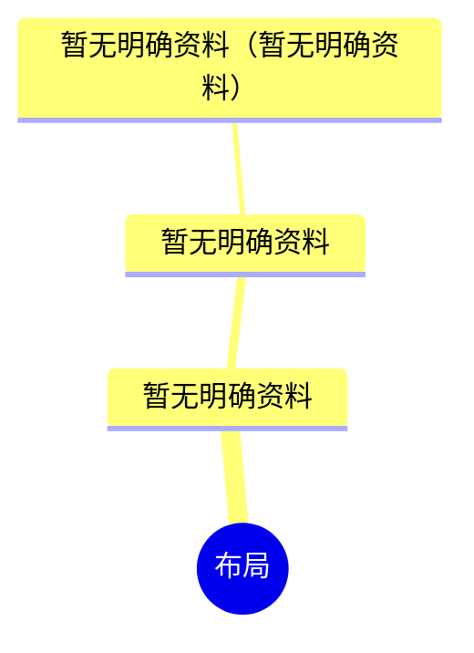

# <应用端> Sitemap

## 0.文档状态

<table>
  <tr><td>文档类型</td><td>Development</td></tr>
  <tr><td>文档版本</td><td>V1</td></tr>
  <tr><td>生成日期</td><td>YYYY-MM-DD</td></tr>
  <tr><td>产品端与形态</td><td><应用端></td></tr>
</table>

## 1.layout布局方式

### 1.1.布局方式说明

暂无明确资料。

### 1.2.区域、分组与元素

| 区域ID | 区域 | Group ID | 分组 | Element ID | 元素 | 类型 | 说明 |
|---|---|---|---|---|---|---|---|
| LYT-001 | 暂无明确资料 | LYG-001 | 暂无明确资料 | LYE-001 | 暂无明确资料 | 暂无明确资料 | 暂无明确资料。 |

## 2.sitemap站点/APP地图

### 2.1.sitemap思维导图

### 2.2.页面清单

| ID | 父级ID | 层级 | 页面/模块 | 页面类型 | 状态组 | 用户角色 | 核心场景 | 来源PEF-ID | 备注/关联待确认ID |
|---|---|---|---|---|---|---|---|---|---|
| PAGE-001 |  | 1 | 暂无明确资料 | 节点 |  | 暂无明确资料 | 暂无明确资料 | PEF-000 |  |

## 3.待确认与假设

- C-000【待确认】
  - 内容：暂无待确认项。
  - 影响范围：无。
  - 用户回复：

## 4.用户补充说明

用户可在此补充新的 sitemap 想法、确认项修改或页面范围调整：
