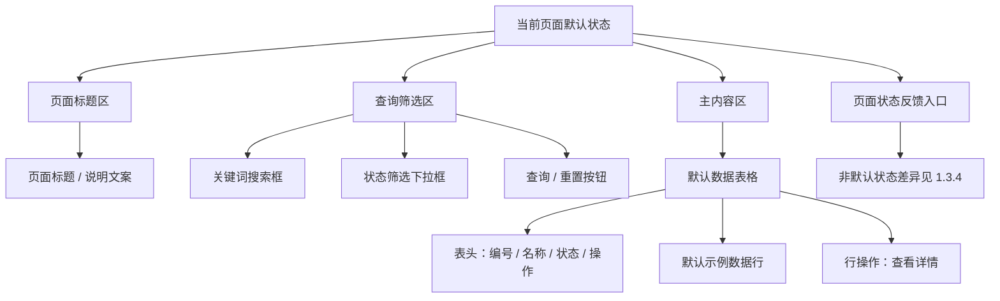

# <页面/模块> Page Layout

## 0.文档状态

<table>
  <tr><td>文档类型</td><td>Development</td></tr>
  <tr><td>文档版本</td><td>V1</td></tr>
  <tr><td>生成日期</td><td>YYYY-MM-DD</td></tr>
  <tr><td>来源Sitemap</td><td>product/layout/<应用端>-sitemap.md</td></tr>
  <tr><td>使用Layout</td><td><产品端与形态 / layout名称></td></tr>
  <tr><td>页面清单ID</td><td>PAGE-000</td></tr>
  <tr><td>状态组</td><td></td></tr>
</table>

## 1.页面布局说明

### 1.1.页面目标与范围

暂无明确资料。

### 1.2.使用的layout与状态

| 引用项 | 值 | 说明 |
|---|---|---|
| 来源Sitemap | product/layout/<应用端>-sitemap.md | 后续 skill 需要合并全局壳时，应回读该 sitemap。 |
| 使用Layout | <产品端与形态 / layout名称> | 仅作为 layout 引用，不在当前页面文档中展开顶栏、侧栏、底栏、导航等全局元素。 |
| 页面挂载上下文 | <父级链 / 导航上下文> | 说明当前页面属于哪个业务模块或页面容器。 |
| 全局Layout读取位置 | 来源Sitemap `1.layout布局方式` 与 `1.2.区域、分组与元素` | 当前文档专注页面本体，后续合并分析时再读取全局 layout。 |

### 1.3.完整页面内容

#### 1.3.1.默认状态页面结构

生成时必须替换为当前页面默认状态的可见结构说明。默认状态是唯一完整页面基线，至少覆盖：

- 页面标题区：标题、副标题/状态说明、面包屑、主操作、次操作。
- 查询/筛选区：每个输入框、下拉框、日期选择器、Radio/Checkbox/Tab/分段控件、默认值、占位文案、选项、校验规则。
- 主内容区：表格/卡片/列表/时间线/步骤条/详情区的具体字段、状态标签、操作入口。
- 表格内容：表格名称、工具栏按钮、筛选项、全部表头、单元格内容类型、行操作、分页/排序/选择、空/加载/错误状态。
- 弹窗/抽屉/对话框：触发方式、标题、正文控件、底部按钮、关闭/取消/提交后的反馈。

#### 1.3.2.默认状态元素细节

默认状态下逐项列出页面本体元素：按钮、输入框、下拉框、Radio/Checkbox、Tab、表格列、行操作、卡片字段、时间线节点、弹窗触发入口、校验提示。

#### 1.3.3.状态清单

| 状态ID | 状态名称 | 状态类型 | 触发条件 | 影响区域/元素 | 是否默认状态 | 布局处理方式 |
|---|---|---|---|---|---|---|
| STATE-VIEW-001 | 默认状态 | 页面视图状态 | 首次进入或查询有数据 | 全页面默认结构 | 是 | 完整页面基线 |
| STATE-VIEW-002 | 空状态 | 页面视图状态 | 当前筛选无数据 | 主内容区/数据表格 | 否 | 复用默认布局，替换主内容为空状态 |
| STATE-VIEW-003 | 加载状态 | 页面视图状态 | 首次加载或筛选刷新中 | 主内容区/数据表格 | 否 | 复用默认布局，显示加载提示 |
| STATE-VIEW-004 | 错误状态 | 页面视图状态 | 数据请求失败 | 主内容区/数据表格/重试按钮 | 否 | 复用默认布局，显示错误提示和重试操作 |

#### 1.3.4.状态差异说明

只描述非默认状态相对默认状态的变化，例如：默认表格替换为空状态文案、提交按钮禁用、显示错误提示、打开弹窗或替换某个状态标签。不要为每个状态重复描述整页布局。

### 1.4.默认状态页面结构图

### 1.5.页面元素清单

| ID | 元素来源 | 区域 | Group ID | 分组 | Element ID | 元素 | 类型 | 状态/数据分类 | 是否状态差异元素 | 状态差异说明 | 数据来源 | 交互/校验规则 | 备注/关联待确认ID |
|---|---|---|---|---|---|---|---|---|---|---|---|---|---|
| PLE-001 | Page Content | 内容区 | PGR-001 | 页面标题区 | PEL-001 | 页面标题 | 文本 | 默认状态 | 否 | 无 | 页面清单/业务上下文 | 展示当前页面名称与业务状态。 |  |
| PLE-002 | Page Content | 内容区 | PGR-002 | 查询筛选区 | PEL-002 | 关键词搜索框 | 输入框 | 默认状态 | 否 | 无 | 页面清单/业务上下文 | 支持输入关键词；为空时展示默认列表。 |  |
| PLE-003 | Page Content | 内容区 | PGR-002 | 查询筛选区 | PEL-003 | 状态筛选下拉框 | 下拉框 | 默认状态/选项：全部/待处理/已完成/异常 | 否 | 无 | 页面清单/业务上下文 | 选择后刷新主内容数据。 |  |
| PLE-004 | Page Content | 内容区 | PGR-003 | 主内容区 | PEL-004 | 数据表格 | 表格 | 默认状态 | 否 | 无 | 页面清单/业务上下文 | 表头、行数据、行操作必须在下方拆分。 |  |
| PLE-005 | Page Content | 内容区 | PGR-003 | 主内容区 | PEL-005 | 示例表头-编号 | 表格列 | 默认状态/表格行数据 | 否 | 无 | 页面清单/业务上下文 | 展示业务编号。 |  |
| PLE-006 | Page Content | 内容区 | PGR-003 | 主内容区 | PEL-006 | 示例行操作-查看详情 | 按钮 | 默认状态/表格行操作 | 否 | 无 | 页面清单/业务上下文 | 点击进入详情或打开弹窗。 |  |
| PLE-007 | Derived State | 内容区 | PGR-004 | 页面状态反馈区 | PEL-007 | 空状态容器 | 状态展示 | 空状态 | 是 | 默认表格替换为空状态文案和重置入口。 | 页面状态 | 当前筛选无数据时展示。 |  |
| PLE-008 | Derived State | 内容区 | PGR-004 | 页面状态反馈区 | PEL-008 | 加载状态提示 | 状态展示 | 加载状态 | 是 | 默认主内容区显示加载提示。 | 页面状态 | 数据请求中展示。 |  |
| PLE-009 | Derived State | 内容区 | PGR-004 | 页面状态反馈区 | PEL-009 | 错误状态提示 | 状态展示 | 错误状态 | 是 | 默认主内容区显示错误提示和重试按钮。 | 页面状态 | 数据请求失败时展示。 |  |

## 2.Mock数据

### 2.1.数据分类说明

生成时必须先列默认状态数据集，再列状态差异数据集。默认状态 Mock 需完整覆盖默认页面；空/加载/错误/成功等非默认状态只记录相对默认状态变化的数据、文案或替换内容。

### 2.2.Mock数据表

| Mock ID | 关联元素ID | 数据分类 | 字段 | 示例值 | 数据类型 | 适用状态组/页面类型 | 备注 |
|---|---|---|---|---|---|---|---|
| MOCK-001 | PLE-002 | 默认状态数据集 | 关键词placeholder | 请输入名称/编号/客户 | string | 页面/状态 | 默认状态/查询条件 |
| MOCK-002 | PLE-003 | 默认状态数据集 | 状态筛选-全部 | 全部 | enum | 页面/状态 | 默认状态/下拉选项 |
| MOCK-003 | PLE-005 | 默认状态数据集 | 编号 | ORD-20260518-0001 | string | 页面/状态 | 默认状态/示例行1 |
| MOCK-004 | PLE-006 | 默认状态数据集 | 查看详情 | 可点击 | string | 页面/状态 | 默认状态/行操作 |
| MOCK-005 | PLE-007 | 状态差异数据集 | 空状态文案 | 暂无符合条件的数据 | string | 页面/状态 | 空状态/替换默认表格内容 |
| MOCK-006 | PLE-008 | 状态差异数据集 | 加载状态文案 | 加载中，请稍候 | string | 页面/状态 | 加载状态/覆盖主内容区 |
| MOCK-007 | PLE-009 | 状态差异数据集 | 错误状态文案 | 数据加载失败，请重试 | string | 页面/状态 | 错误状态/显示重试入口 |

## 3.待确认与假设

- C-000【待确认】
  - 内容：暂无待确认项。
  - 影响范围：无。
  - 用户回复：

## 4.用户补充说明

用户可在此补充新的页面布局想法、确认项修改或元素范围调整：
